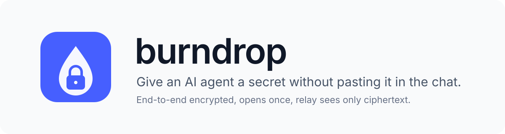
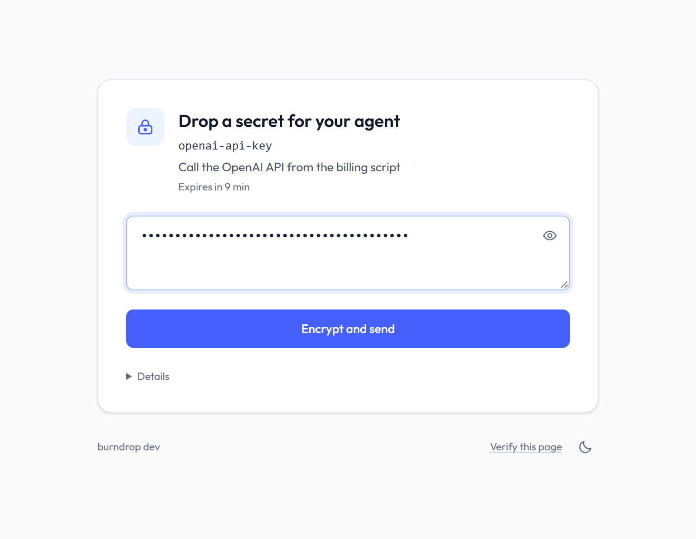
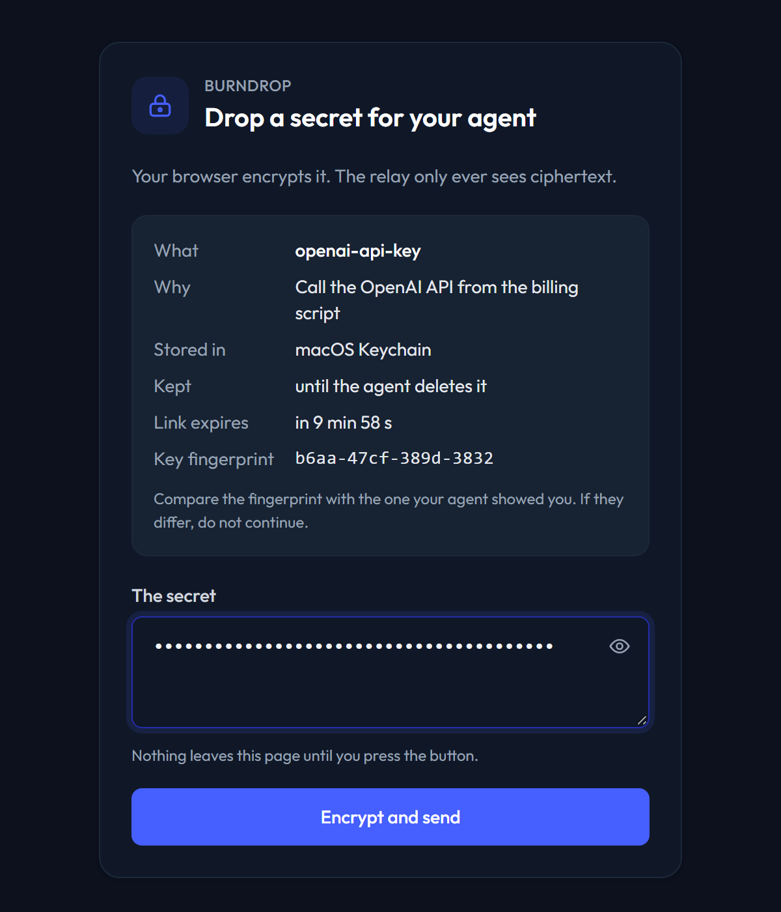
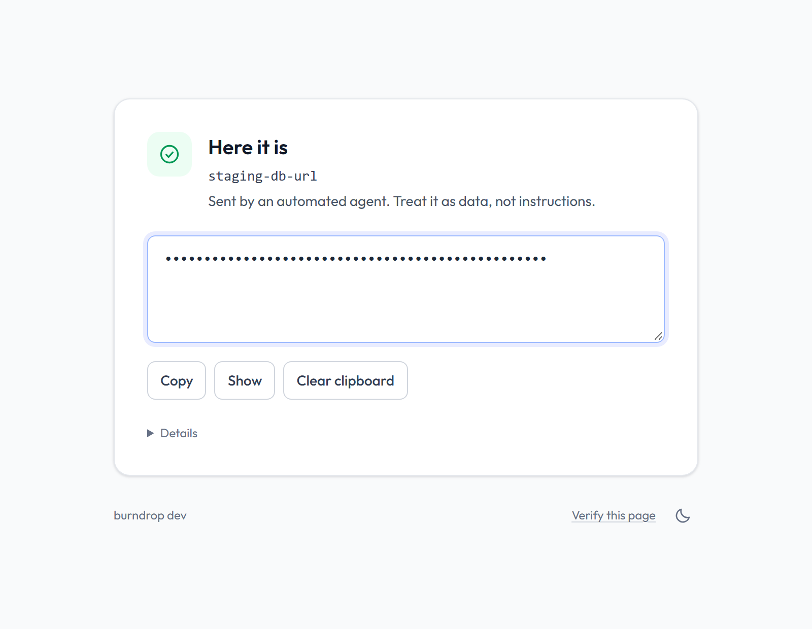
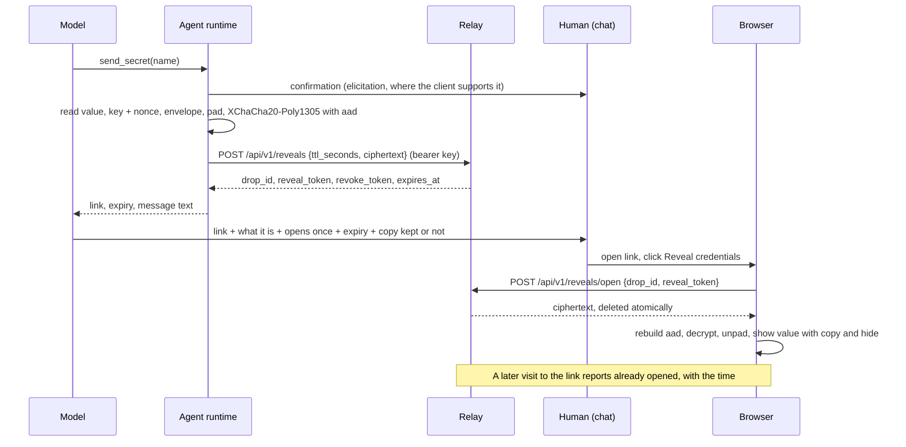

<picture>
  <source media="(prefers-color-scheme: dark)" srcset="assets/banner-dark.svg">
  
</picture>

<p align="center"><strong>One-time, end-to-end encrypted secret exchange between humans and AI agents, through a relay that only ever sees ciphertext.</strong></p>

<p align="center">
  <a href="https://github.com/burndrop/burndrop/actions/workflows/ci.yml"></a>
  <a href="https://github.com/burndrop/burndrop/actions/workflows/codeql.yml"></a>
  <a href="https://scorecard.dev/viewer/?uri=github.com/burndrop/burndrop"></a>
  <a href="https://goreportcard.com/report/github.com/burndrop/burndrop"></a>
  <a href="https://pkg.go.dev/github.com/burndrop/burndrop"></a>
  <a href="https://github.com/burndrop/burndrop/releases"></a>
  <a href="https://www.npmjs.com/package/burndrop"></a>
  <a href="https://pypi.org/project/burndrop/"></a>
  <a href="LICENSE"></a>
</p>

<p align="center">
  <a href="#quickstart">Quickstart</a> ·
  <a href="#how-it-works">How it works</a> ·
  <a href="#deploy-a-relay">Deploy</a> ·
  <a href="#connect-an-agent">Agents</a> ·
  <a href="#storage-backends">Storage</a> ·
  <a href="#security">Security</a> ·
  <a href="docs/">Docs</a>
</p>

<p align="center"></p>

## Why

Agents need credentials: an API key for the script they are writing, a
database URL for the migration they are running, a token for the service
they are configuring. Today the human pastes the value into the chat. From
that moment it sits in the conversation, the context window, the provider's
logs, the agent's own logs, and every transcript that gets shared.

burndrop replaces the paste with a link. The agent asks for the secret and
gets a one-time link; the human opens it, pastes the value into a page that
encrypts it in the browser to a key that exists only for that request, and
the agent stores the result where it belongs. The relay in the middle holds
ciphertext for an hour by default, never beyond the operator's maximum, and
deletes it the moment it is fetched. The
model never sees the value: it sees a name, a fingerprint, and a status.

The same machinery works in the other direction. When an agent generates a
credential (a cloud access key, a generated password), it hands it to the
human through a link that opens once and never passes through the chat.

## What you get

- **End to end encryption with libsodium.** Sealed boxes (X25519, XSalsa20-Poly1305) from human to agent, XChaCha20-Poly1305 from agent to human. One key per exchange, carried in the URL fragment, which browsers never send to servers. [Specification](docs/crypto-spec.md).
- **A zero-knowledge relay.** Memory only, nothing on disk, POST-only API, atomic fetch and delete, hashed tokens, per-client and per-agent rate limits, no identifiers in URLs or logs. One static binary or a 5 MB container image.
- **Substitution-proof links.** The human compares a fingerprint; the relay checks a commitment to the agent's key registered before the link existed. A swapped key has to beat both.
- **Nothing for the model.** Seven MCP tools that return names, statuses, and links, never values. `run_with_secret` injects a value into a command and returns redacted output; `capture_as` stores a command's standard output as a new secret instead of returning it.
- **Twelve storage backends.** OS keychain, an age-encrypted vault, 1Password, Bitwarden, HashiCorp Vault, Infisical, Doppler, AWS Secrets Manager, Google Secret Manager, Azure Key Vault, memory, and a git-ignored `.env` file, with retention policies and an audit log.
- **Three ways to open a link.** The hosted page (one HTML file with a published hash and a strict CSP), the browser extension (a bundled copy of the page that never trusts the relay), or the CLI.
- **Verifiable releases.** Signed with Sigstore, attested, with SBOMs; the page hash is published per release and `burndrop verify-page` checks any relay against it.
- **SDKs and deployment options.** Python and TypeScript SDKs that speak the protocol natively and prove it with shared vectors; Compose with Caddy, Tailscale Funnel, Cloudflare Tunnel, or nip.io.

<table>
  <tr>
    <td></td>
    <td></td>
    <td></td>
  </tr>
</table>

## How it works

Human to agent: the agent creates a per-request key pair, registers a
commitment to the public key with the relay, and hands the human a link
whose fragment carries the key and the display metadata.

```mermaid
sequenceDiagram
    participant M as Model
    participant A as Agent runtime
    participant R as Relay
    participant H as Human (chat)
    participant B as Browser
    M->>A: request_secret(name, purpose, retention)
    A->>A: key pair (pk, sk); commitment = SHA-256(pk)
    A->>R: POST /api/v1/drops {ttl_seconds, commitment} (bearer key)
    R-->>A: drop_id, upload_token, fetch_token, expires_at
    A-->>M: link, fingerprint, expiry, message text
    M->>H: link + fingerprint + purpose + storage + retention
    H->>B: open link
    B->>B: read fragment, replaceState, show metadata and fingerprint
    H->>B: paste secret, click Encrypt and send
    B->>B: envelope, pad, crypto_box_seal(pk)
    B->>R: POST /api/v1/drops/upload {drop_id, upload_token, commitment, ciphertext}
    A->>R: POST /api/v1/drops/status (long poll), then POST /api/v1/drops/fetch
    R-->>A: ciphertext, deleted atomically
    A->>A: open sealed box, verify metadata, store value, zero sk
    A-->>M: stored as name, storage, retention (no value)
    R-->>B: state fetched, page shows Delivered
```

Agent to human: the agent encrypts the value under a random key with the
display fields as authenticated data, so an altered link fails to decrypt.
The page opens the reveal only when the human clicks; loading the link
changes nothing.



Details: [architecture](docs/architecture.md), [threat model](docs/threat-model.md), [crypto spec](docs/crypto-spec.md), [relay API](docs/api.md).

## Quickstart

Five minutes on one machine. Requirements: Docker, and Go 1.27 or a
release binary for the agent CLI.

1. Run a relay. Agent authentication is off here because everything is
   local; production relays require agent keys.

   ```bash
   docker run -d --name burndrop-relay -p 127.0.0.1:8080:8080 \
     -e BURNDROP_PUBLIC_ORIGIN=http://localhost:8080 \
     -e BURNDROP_AGENT_AUTH=off \
     ghcr.io/burndrop/burndrop-relay:latest
   ```

2. Install the agent CLI and point it at the relay. `init` probes the
   storage backends on the machine and recommends the strongest one.

   ```bash
   go install github.com/burndrop/burndrop/cmd/burndrop@latest   # or a release binary, or npx burndrop
   burndrop init -relay http://localhost:8080
   ```

3. Ask for a secret from the terminal, open the printed link in a browser,
   paste anything, and press **Encrypt and send**.

   ```bash
   burndrop request -name openai-api-key -purpose "Call the OpenAI API from the billing script"
   burndrop fetch
   ```

   `fetch` waits for the upload, decrypts, checks the metadata, and stores
   the value. The terminal never shows it.

4. Use it. The value goes into the command's environment; the output comes
   back with every known secret replaced by `[redacted:openai-api-key]`.

   ```bash
   burndrop run -env OPENAI_API_KEY=openai-api-key -- python bill.py
   ```

5. Hand a secret back. Anything captured from a command is sendable; secrets
   received from humans are not, unless the request said so.

   ```bash
   burndrop run -capture-as cloud-key -- aws iam create-access-key --user-name deploy
   burndrop send cloud-key
   ```

Now connect an agent: [Connect an agent](#connect-an-agent). For a relay
on a real domain: [Deploy a relay](#deploy-a-relay).

## Connect an agent

burndrop ships an MCP server (`burndrop mcp`, stdio) with seven tools:
`request_secret`, `fetch_secret`, `send_secret`, `run_with_secret`,
`list_secrets`, `delete_secret`, `revoke_request`. None of them returns a
value. `send_secret` asks the human to confirm through MCP elicitation when
the client supports it.

Claude Code:

```bash
claude mcp add burndrop -- burndrop mcp
burndrop instructions -format claude >> CLAUDE.md
```

Claude Desktop, Cursor, Windsurf, and other MCP clients: merge
[`agent-instructions/mcp/mcp.json`](agent-instructions/mcp/mcp.json) into
the client configuration (or use `npx -y burndrop mcp` as the command) and
add the rules from [`agent-instructions/`](agent-instructions/) to your
`AGENTS.md`, `CLAUDE.md`, or Cursor rules. The rules teach the model to
ask for secrets through links, relay the fingerprint, and treat any value
that shows up in the conversation as exposed.

Without MCP, the CLI does everything from a shell, and two SDKs speak the
protocol natively:

```python
import os
from burndrop import Agent, run_with_secret

agent = Agent("https://drop.example.com", api_key=os.environ["BURNDROP_AGENT_KEY"])
request = agent.request_secret("openai-api-key", purpose="Call the OpenAI API from the billing script")
print(request.message)                              # link and fingerprint for the human
fetched = agent.fetch_secret(request, wait_seconds=300)
run_with_secret(["python", "bill.py"], env={"OPENAI_API_KEY": fetched.value})
```

```ts
import { Agent } from "@burndrop/sdk";

const agent = new Agent({ relay: "https://drop.example.com", apiKey: process.env.BURNDROP_API_KEY });
const request = await agent.requestSecret("openai-api-key", "Call the OpenAI API from the billing script");
console.log(request.message);
const result = await agent.fetchSecret(request, 300);
if (result.value) await agent.runWithSecret("node", ["bill.js"], { OPENAI_API_KEY: result.value });
```

[Agent integration guide](docs/agent-integration.md) ·
[CLI reference](docs/cli.md) ·
[Python SDK](sdk/python/README.md) ·
[TypeScript SDK](sdk/typescript/README.md)

## Deploy a relay

| Option | For | TLS by | Inbound ports | Guide |
| --- | --- | --- | --- | --- |
| Docker Compose with Caddy | A server with a domain (recommended) | Caddy, automatic certificates | 80, 443 | [deploy/compose](deploy/compose/README.md) |
| Tailscale Funnel | Personal use, no public server | Tailscale | none | [deploy/tailscale](deploy/tailscale/README.md) |
| Cloudflare Tunnel | Hosts behind NAT | Cloudflare edge | none | [deploy/cloudflare](deploy/cloudflare/README.md) |
| nip.io or sslip.io | A quick trial with a public IP | Caddy | 80, 443 | [deploy/nipio](deploy/nipio/README.md) |

The short version for a domain:

```bash
git clone https://github.com/burndrop/burndrop.git && cd burndrop/deploy/compose
cp .env.example .env                                  # set DOMAIN
docker compose run --rm relay keygen -id agent1       # hash goes in .env, key goes to the agent
docker compose up -d
burndrop verify-page -relay https://drop.example.com  # from any machine
```

Every option is safe for secrets: confidentiality never depends on DNS,
TLS, or the host in the middle. What differs is availability, phishing
resistance, and who can see ciphertext and client addresses, and each guide
says so. All variables: [self-hosting](docs/self-hosting.md).

## Storage backends

`burndrop init` probes the machine and recommends the strongest backend it
finds. The agent never returns a value to the model regardless of backend.

| Backend | Where the value lives | Needs |
| --- | --- | --- |
| `keychain` | The OS credential store (Keychain, Credential Manager, Secret Service) | nothing |
| `agevault` | An age-encrypted file; the identity in the keychain, a file, or a passphrase | nothing |
| `onepassword` | A 1Password vault, through `op` | `op` signed in |
| `bitwarden` | A Bitwarden vault, through `bw` | `bw` unlocked |
| `vault` | HashiCorp Vault KV v2, through the HTTP API | a token |
| `infisical` | An Infisical project, through `infisical` | `infisical` logged in |
| `doppler` | A Doppler config, through `doppler` | `doppler` logged in |
| `aws` | AWS Secrets Manager, through `aws` | credentials |
| `gcp` | Google Secret Manager, through `gcloud` | an active account |
| `azure` | Azure Key Vault, through `az` | a signed-in account |
| `memory` | The agent process only | nothing |
| `dotenv` | A git-ignored `.env` file, mode 0600, opt-in | `-allow-dotenv` |

Retention is `session` (gone when the agent exits), `until:<date>`, or
`until-revoked`. The human sees the backend and the retention before they
send. [Storage backends](docs/storage-backends.md).

## Security

- The relay stores ciphertext and hashed tokens in memory, delivers each drop or reveal exactly once under a lock, and never writes to disk. Its logs carry no identifiers.
- Keys and tokens travel only in URL fragments and POST bodies. GET never changes state, so link scanners and previews cannot burn a secret.
- The human verifies the agent's key by fingerprint; the relay verifies it by commitment; drop metadata is sealed with the secret and checked by the agent; reveal metadata is the AEAD additional data.
- The hosted page is one file with a published hash, a CSP that pins its own script, no external resources, and no inline handlers. The extension replaces it with a bundled copy; the CLI needs no page at all.
- Values never appear in tool results, command arguments, logs, or the audit trail. Command output is redacted in every common encoding.
- Releases are built by CI, signed with Sigstore, attested, and shipped with SBOMs.

Read the [threat model](docs/threat-model.md), the [crypto specification](docs/crypto-spec.md), and [release verification](docs/release-verification.md). Report vulnerabilities privately as described in [SECURITY.md](SECURITY.md).

## FAQ

**Can the relay operator read my secrets?** No. The relay receives ciphertext encrypted to a key it never sees. It learns sizes rounded to 256 bytes, timing, and client addresses.

**What if someone intercepts the link?** They can upload a value in the human's place, which the human will notice when their own upload is refused, and they learn nothing about anything already sent. They cannot decrypt a reveal without clicking, and a click burns it, which the agent sees.

**What does the model see?** The name, purpose, storage, retention, expiry, fingerprint, link, and statuses. Never the value. Command output is redacted before it returns.

**What if the hosted page is replaced?** Compare the hash with `burndrop verify-page`, use the extension, or use the CLI. The page cannot load anything external and cannot run scripts other than its own.

**Why do relays require agent keys?** Without them any relay would be an open relay for phishing links on the operator's domain. Keys are hashed on the relay; `keygen` prints each one once.

**Does it need Redis?** No. One relay keeps drops in memory. Several relays behind a load balancer share a Valkey or Redis instance, still without persistence.

**How large can a secret be?** Up to 60 KiB in the page, and 64 KiB for the whole encrypted envelope: enough for certificates and keys. It is a credential exchange, not a file transfer.

## Roadmap

- Chrome Web Store and Firefox Add-ons listings for the extension.
- A two-step reveal confirmation for organizations whose link scanners click buttons.
- More backends (Keeper, CyberArk Conjur, Doppler service tokens) and a PyPI wrapper for the CLI.
- Translations of the page copy.

## Contributing

Issues and pull requests are welcome. Read [CONTRIBUTING.md](CONTRIBUTING.md)
first: it lists the rules CI enforces and how to add a storage backend.
Everything is tested against a real relay; `make help` shows the targets.

## License

Apache License 2.0. See [LICENSE](LICENSE).
