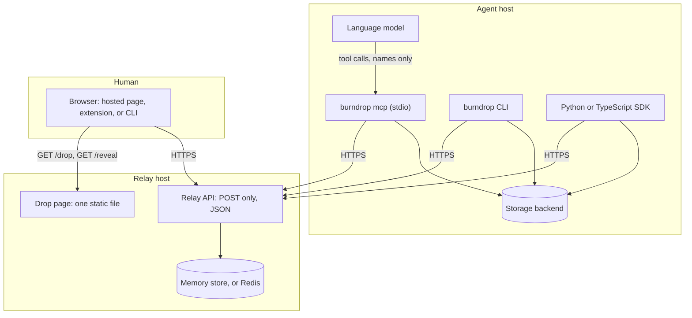
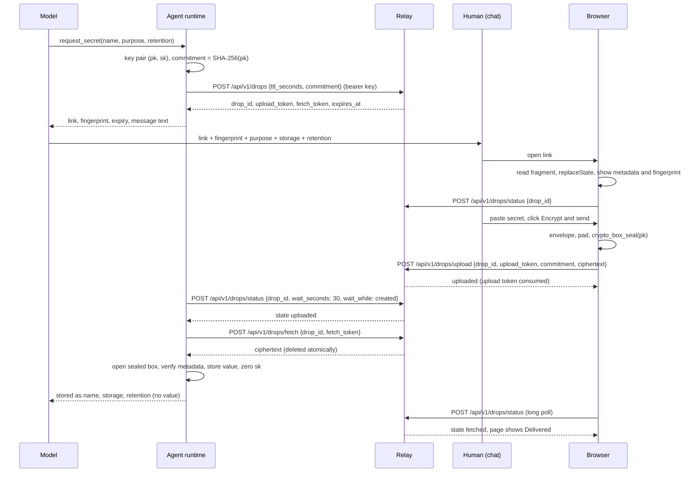
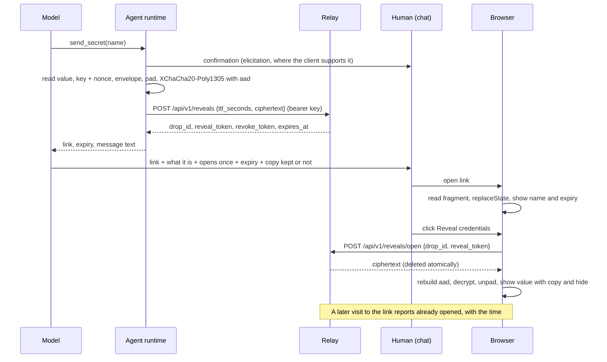

# Architecture

burndrop moves a secret between a human and an AI agent exactly once,
encrypted end to end, through a relay that can neither read nor alter it.
This page describes the parts, where trust lives, how the two flows move,
and which test proves each property. The threat model is in
`threat-model.md`; the byte-level rules are in `crypto-spec.md`.

## Parts



| Part | Code | What it does |
| --- | --- | --- |
| Relay | `cmd/burndrop-relay`, `internal/relay` | Holds ciphertext for the requested lifetime (one hour by default, capped by the operator), hands it out once, deletes it atomically, and serves the page. Memory store by default, Redis or Valkey for several instances. Nothing touches a disk. |
| Agent binary | `cmd/burndrop`, `internal/agent`, `internal/mcpserver`, `internal/storage` | The MCP server and CLI an agent runs. Creates requests, fetches and stores secrets, runs commands with secrets injected, sends secrets, keeps an audit log. Twelve storage backends. |
| Crypto | `internal/crypto`, `web/src/crypto.ts`, the SDK crypto modules | One small module per language, same structure, shared vectors. |
| Links | `internal/link`, `web/src/link.ts` | Build and parse the fragments. |
| Page | `web/` | One HTML file (script, style, and font inlined) that encrypts a secret to the agent's key or decrypts one from the agent. Embedded in the relay, served with a Content-Security-Policy that pins its own script hash. |
| Extension | `extension/` | Replaces the hosted page with a bundled copy on the relays the user configures, and verifies hosted pages against the release hash. |
| SDKs | `sdk/python`, `sdk/typescript` | The protocol in native code for agents that do not run the binary. |
| Deployment | `Dockerfile`, `deploy/` | Distroless image; Compose with Caddy, Tailscale, Cloudflare Tunnel, nip.io. |

Two binaries come from one Go module on purpose: the relay image stays
tiny and free of keychain and CLI code, and the agent binary carries the
backends and the MCP server.

## Where trust lives

1. The relay is a mailbox assumed hostile. It sees ciphertext, drop ids, hashed tokens, sizes rounded to 256 bytes, timing, and client addresses. It cannot read a secret, produce a valid secret, or change what the page shows without the change being detected.
2. All keys travel in URL fragments, which browsers do not send to servers, or in POST bodies. No identifier ever appears in a URL path or query string, so no log, proxy, or CDN can contain one.
3. The human verifies the agent's key by comparing a fingerprint shown in the chat with one computed by the page. The relay verifies the same key through a commitment registered before the link exists. A key substitution has to beat both.
4. The model sees names and metadata only. Every tool result is filtered, every command output is redacted, and the audit log records events, not values.
5. Confidentiality does not depend on TLS, DNS, or the host in the middle. Those affect availability, phishing resistance, and who sees metadata, which each deployment guide states.

## The two flows

### Human to agent



### Agent to human



## Properties and where they are proven

| Property | Enforced in | Proven by |
| --- | --- | --- |
| The relay never sees plaintext or keys | Keys only in fragments and the agent's memory | `internal/relay` adversarial tests dump the store and logs and grep for every secret and key; the page suite asserts the fragment is gone before the first request |
| A secret is delivered at most once | Atomic fetch and open under one lock or one Lua script | Concurrent open and double open tests for both stores |
| GET never mutates | Only POST handlers change state; the page opens a reveal on click only | Scanner tests (GET and HEAD on every path) and the no-click-no-burn page test |
| A substituted key is detected | Fingerprint on the page and commitment at the relay | Key swap and commitment mismatch tests in Go and Playwright |
| An altered reveal link fails closed | Display fields are the AEAD additional data | Tampered name test in Go and Playwright |
| Nothing sensitive in logs | Handlers log only method, path, status, duration, and outcome codes | Log grep tests |
| The model never sees a value | Tool results carry names and metadata; outputs are redacted | `internal/mcpserver` leak assertions over every tool |
| Values never appear in child process arguments | `Runner` passes values by stdin, environment of the child only when the caller asked, or temporary files with mode 0600 | `assertNoSecretInArgs` in every backend suite |
| The page served is the page released | Build-time hash, CSP script hash, `verify-page`, extension verify mode | `web` embed tests, CLI verify tests, extension suite |
| The three crypto implementations agree | Shared vectors and interop files | `spec/vectors.json` in every suite, `spec/interop` job |

## Repository layout

```
cmd/burndrop            agent CLI and MCP server entry point
cmd/burndrop-relay      relay entry point
internal/crypto         primitives, envelope, tokens (audited module)
internal/link           link build and parse
internal/relay          config, stores, handlers, rate limits, headers
internal/client         Go relay client with long polling
internal/storage        backend interface, index, manager, twelve backends
internal/agent          request, fetch, send, run, audit, redaction, config
internal/mcpserver      the seven MCP tools
web                     drop page source, build, unit and end-to-end tests
extension               browser extension
sdk/python, sdk/typescript
spec                    vectors.json and interop files
deploy                  deployment guides and Compose files
docs                    this documentation
agent-instructions      generated instruction files for agents
```
