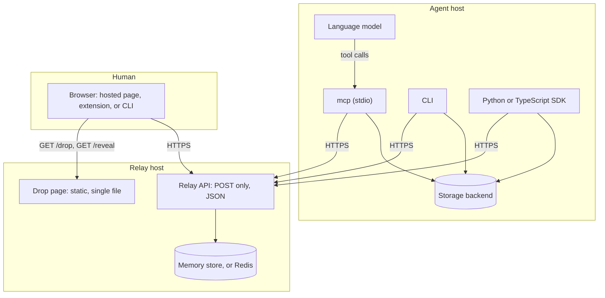
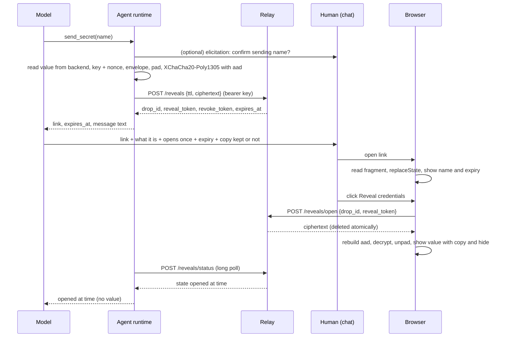

# Design document

Status: Phase 0 draft for review. No application code has been written. The project name is pending; `<name>` marks places where it will be substituted.

This document covers the recommended stack, the cryptography (as a spec a reviewer can check line by line), the relay API, data flow, storage, the agent runtime and MCP tools, the SDKs, the drop page and extension, deployment, repository layout, testing, CI and release, documentation, and the license. Section 18 lists every decision that differs from the original brief, numbered, so each one can be approved or rejected.

## 1. Summary

Two binaries built from one Go module, one single-file drop page, one browser extension, two thin SDKs.

| Component | Language | Ships as |
|---|---|---|
| Relay | Go, standard library HTTP | Static binary, distroless container (about 10 MB) |
| Agent runtime: CLI plus MCP server plus storage backends | Go | Static binary; also via an npm wrapper package (`npx <name> mcp`, the esbuild optionalDependencies pattern), Homebrew, GitHub Releases, Docker. A PyPI wrapper for `uvx` is a roadmap item |
| Drop page | TypeScript, Tailwind CSS v4, vanilla DOM, libsodium | One self-contained HTML file, embedded in the relay binary, published with its SHA-256 |
| Browser extension | Same TypeScript and page bundle | Chrome (MV3) and Firefox packages |
| TypeScript SDK | TypeScript | npm package |
| Python SDK | Python 3.10+ | PyPI package |
| Protocol spec and test vectors | JSON plus Markdown | `spec/` folder, used by all three language test suites |

The relay does no cryptography. It stores ciphertext, hashes of tokens, state, and expiry, in memory by default.

## 2. Goals and non-goals

Goals: everything in the brief, plus the additions in section 18. Non-goals for version 1.0: multi-recipient drops, file attachments larger than the size limit, a web UI for operators, accounts or logins of any kind, and a hosted service run by the project.

## 3. Recommended stack and why

### 3.1 Relay and agent runtime: Go

- One static binary per role, no runtime, no shared libraries. The relay container is `FROM scratch` or distroless, runs as a non-root user, and is a few megabytes.
- Go's standard library covers HTTP, TLS, JSON, `crypto/rand`, SHA-256, and structured logging (`log/slog`). Go 1.22+ has method-aware routing in `net/http`, so there is no router dependency.
- `golang.org/x/crypto` provides `nacl/box.SealAnonymous` (libsodium `crypto_box_seal` compatible) and `chacha20poly1305.NewX` (libsodium `crypto_aead_xchacha20poly1305_ietf` compatible). No CGO.
- The official MCP Go SDK (`modelcontextprotocol/go-sdk`, maintained with Google) provides the stdio transport, typed tools, and elicitation.
- Storage backends need OS keychains (`zalando/go-keyring`), age (`filippo.io/age`), and subprocess calls to vendor CLIs. All are natural in Go.
- Reproducible builds (`-trimpath`, pinned toolchain) make the published hashes and attestations meaningful.

Alternatives considered: Rust (equally good binary story, slower iteration, fewer contributors for this kind of tool; the official MCP Rust SDK is younger). A TypeScript agent runtime (best `npx` ergonomics, but an `npx`-fetched CLI is a weak trust anchor for the "zero trust in any network" tier, storage backends would then live in Node, and a Node single-file executable is about 80 MB).

Relay dependencies, each with a reason:

| Dependency | Why |
|---|---|
| Go standard library | HTTP, TLS, JSON, hashing, randomness, logging, embedding the page |
| `golang.org/x/time/rate` | Token-bucket rate limiting; small, maintained by the Go team |
| `github.com/redis/go-redis/v9` | Optional Redis or Valkey store for multi-instance deployments; only used when `STORE=redis` |

Agent runtime dependencies, each with a reason:

| Dependency | Why |
|---|---|
| `golang.org/x/crypto` | Sealed boxes, XChaCha20-Poly1305, constant-time compares |
| `github.com/modelcontextprotocol/go-sdk` | MCP server over stdio |
| `github.com/zalando/go-keyring` | macOS Keychain, Windows Credential Manager, Linux Secret Service |
| `filippo.io/age` | Encrypted local vault file |
| `github.com/BurntSushi/toml` | The one agent config file |
| `github.com/spf13/cobra` or the standard `flag` package | CLI command tree. Preference: standard `flag` with a small internal command router, to keep the dependency list short |

Everything else (HTTP client, JSON, subprocess handling, redaction) is standard library.

### 3.2 Drop page and extension: TypeScript, Tailwind v4, vanilla DOM, libsodium

- No framework. The page has two modes and about a dozen states. A small state machine in plain TypeScript is easier to audit than any framework and needs no CSP exceptions for evaluation.
- Tailwind v4 compiled at build time with the standalone CLI, purged to the classes used, inlined into the page.
- `libsodium-wrappers` 0.8.x (standard build, not sumo) for `crypto_box_seal`, `crypto_aead_xchacha20poly1305_ietf_decrypt`, `sodium_pad`, `randombytes_buf`, and `memzero`. Pinned by version and by hash of the bundled WebAssembly. Verified facts (2026-09-17): the standard build has every call above but not `crypto_hash_sha256`, so fingerprints and commitments in the browser use WebCrypto `crypto.subtle.digest("SHA-256")`, which every browser has. The WebAssembly build requires `'wasm-unsafe-eval'` in `script-src` (tested in Chromium; without it `WebAssembly.instantiate` is blocked and the ESM build has no JavaScript fallback). That directive permits WebAssembly compilation only, not script evaluation, and is documented in the crypto spec. Size: about 434 KB minified, 150 KB gzipped, which is acceptable for a page that loads once per exchange. The fallback if the directive is judged unacceptable is the audited pure-JavaScript `@noble` family, at the cost of composing the sealed box from primitives ourselves.
- Build with esbuild to one HTML file: inlined CSS, inlined script, inlined subset of the Outfit font, inlined SVG icons. No external requests except to the relay API.

Why not WebCrypto alone: WebCrypto has X25519 (Chrome 133, Firefox 130, Safari 18.4) but no XChaCha20-Poly1305 and no sealed box; ChaCha20-Poly1305 is only now reaching Chrome 154 and no other stable browser has it. Building the equivalent from X25519 plus HKDF plus AES-GCM would be a custom construction with no cross-language vectors. Why not HPKE (RFC 9180): it is the modern standard for "encrypt to a public key", Go 1.26 ships it in the standard library, and it offers additional data and a post-quantum path that sealed boxes lack. But the JavaScript implementation's X25519 path is pure JavaScript with a vendored curve library and is not formally audited, and the Python library is pre-1.0. Sealed boxes are one audited call with identical bytes in all three stacks (x/crypto ships a libsodium-generated test vector). The trade-off is recorded in the crypto spec, and HPKE is the natural upgrade path for a version 2 link format.

### 3.3 SDKs

- Python: `PyNaCl` for the crypto, `httpx` or the standard library for HTTP (preference: standard library `urllib` to keep the dependency list at one), `keyring` for the OS keychain backend.
- TypeScript: `libsodium-wrappers`, native `fetch`, WebCrypto SHA-256, `@napi-rs/keyring` for the OS keychain backend. `engines.node >= 22.13` (Node 20 reached end of life in April 2026).

## 4. Architecture



Principles:
1. The relay is a dumb, hostile-by-assumption mailbox. All trust lives at the ends.
2. Every identifier and token travels in URL fragments or POST bodies, never in a URL path or query string. Logs are clean by construction.
3. One crypto module per language, identical in structure, with shared test vectors.
4. The model sees names and metadata only.

## 5. Cryptography specification

This section is the crypto spec. It will be published as `docs/crypto-spec.md` with the same numbering so a reviewer can check the code against it.

### 5.1 Primitives

| Purpose | Primitive | Library calls |
|---|---|---|
| Human to agent encryption | libsodium sealed box: X25519 ephemeral key agreement, XSalsa20-Poly1305, nonce = BLAKE2b-24(ephemeral pk, recipient pk) | Browser: `crypto_box_seal`. Go: `box.SealAnonymous` / `box.OpenAnonymous`. Python: `nacl.public.SealedBox` |
| Agent to human encryption | XChaCha20-Poly1305 (IETF), 256-bit key, 192-bit nonce, 128-bit tag, with additional data | Browser: `crypto_aead_xchacha20poly1305_ietf_decrypt`. Go: `chacha20poly1305.NewX`. Python: `nacl.bindings.crypto_aead_xchacha20poly1305_ietf_*` |
| Fingerprint and commitments | SHA-256 | Standard library in each language |
| Randomness | OS CSPRNG | `randombytes_buf`, `crypto/rand`, `os.urandom` via PyNaCl |
| Padding | ISO/IEC 7816-4 (append `0x80`, then `0x00` to the block boundary), block 256 bytes | `sodium_pad` / `sodium_unpad`; reimplemented in Go and Python in a few lines with test vectors |
| Encoding | base64url without padding for all binary fields in URLs and JSON | Standard library |

No other primitives are used anywhere in the system. The relay uses SHA-256 (token hashing) and `crypto/rand` only.

### 5.2 Identifiers and tokens

- Drop ID: 16 random bytes, base64url (22 characters).
- Upload token, fetch token, reveal token, revoke token: 16 random bytes each, base64url. The relay stores `SHA-256(token)` and compares hashes in constant time.
- Agent API key: 32 random bytes, base64url, presented as a bearer token; the relay stores `SHA-256(key)` with a key ID.

### 5.3 Drop (human to agent)

1. Agent generates an X25519 keypair `(pk, sk)` for this request only.
2. Agent computes `commitment = SHA-256(pk)` and creates a slot on the relay with it.
3. Agent builds the link (section 5.6) containing `pk`, the drop ID, the upload token, and the display metadata.
4. Agent computes `fingerprint = hex(SHA-256(pk)[0:8])` formatted as `xxxx-xxxx-xxxx-xxxx` and sends it in chat with the link.
5. Browser parses the fragment, removes it from the address bar, shows the metadata and the fingerprint computed from `pk`.
6. Browser builds the envelope (section 5.5), pads it to a multiple of 256 bytes, seals it: `ct = crypto_box_seal(padded, pk)`.
7. Browser uploads `{drop_id, upload_token, commitment = SHA-256(pk), ciphertext = base64url(ct)}`.
8. Relay checks the token hash, checks the commitment equals the one from step 2, stores the ciphertext, marks the slot uploaded, consumes the upload token.
9. Agent fetches with the fetch token. The relay returns the ciphertext and deletes it in the same locked operation, leaving a tombstone with state `fetched`.
10. Agent opens the sealed box with `sk`, unpads, parses the envelope, verifies that the metadata inside equals what it put in the link, stores the value in the backend, zeroes `sk` and the value, and returns only the reference name and metadata to the model.

Forward secrecy statement: compromise of the agent after step 10 reveals nothing about this drop because `sk` no longer exists and the relay no longer has the ciphertext. Compromise of the relay at any time reveals nothing because it never has `sk`.

### 5.4 Reveal (agent to human)

1. Agent reads the value from the storage backend by reference name.
2. Agent generates `key` (32 random bytes) and `nonce` (24 random bytes).
3. Agent builds the envelope, pads it, and encrypts: `ct = xchacha20poly1305_ietf_encrypt(padded, aad, nonce, key)` where `aad` is the canonical display string (section 5.6).
4. Agent creates a reveal slot with `ciphertext = base64url(nonce || ct)` and receives the drop ID, reveal token, and revoke token.
5. Agent builds the link containing the drop ID, reveal token, `key`, and the display fields, and tells the human what it is, that it opens once, when it expires, and whether the agent keeps its own copy.
6. Browser parses the fragment, removes it from the address bar, shows the display fields, and waits for the click.
7. On click, browser posts `{drop_id, reveal_token}`. The relay returns the ciphertext and deletes it atomically, leaving a tombstone with state `opened`.
8. Browser rebuilds `aad` from the display fields, decrypts, unpads, parses the envelope, and shows the value. If `aad` was altered in the link, decryption fails and the page says the link was altered.

### 5.5 Envelope

Plaintext is a UTF-8 JSON document, then padded.

Drop envelope:

```json
{"v":1,"type":"drop","name":"openai-api-key","purpose":"Call the OpenAI API from the billing script","storage":"macOS Keychain","retention":"until-revoked","fingerprint":"a1b2-c3d4-e5f6-a7b8","format":"text","secret":"sk-..."}
```

Reveal envelope:

```json
{"v":1,"type":"reveal","name":"staging-db-url","format":"text","secret":"postgres://..."}
```

`format` is `text` or `base64` (for binary secrets such as certificates). Maximum unpadded envelope size is 64 KiB by default; the relay enforces a ciphertext size limit derived from it. The agent rejects a drop envelope whose `name`, `purpose`, `storage`, `retention`, or `fingerprint` differ from what it generated.

### 5.6 Link format

Links carry everything after `#`. Fragments are never sent to any server. Fields are `key=value` pairs joined by `&`, values percent-encoded, binary values base64url.

Drop link: `https://<page-host>/drop#v=1&i=<drop_id>&u=<upload_token>&k=<recipient_pk>&n=<name>&p=<purpose>&s=<storage>&t=<retention>[&r=<relay_origin>]`

Reveal link: `https://<page-host>/reveal#v=1&i=<drop_id>&o=<reveal_token>&k=<key>&n=<name>&c=<0|1 agent keeps a copy>[&r=<relay_origin>]`

Rules:
- `v` must be `1`. Any other value is refused with a clear error; there is no fallback parsing.
- `k` must decode to exactly 32 bytes; `i`, `u`, `o` to exactly 16 bytes.
- `n` at most 100 characters, `p` and `s` at most 200 characters, `t` one of `session`, `until-revoked`, or `until:<RFC 3339 date>`.
- `r`, when present, must be an `https://` origin (or `http://localhost` for development). The hosted page accepts `r` only if it matches its configured relay allowlist (default: its own origin). The extension and CLI use `r` directly, defaulting to the link's origin when absent.
- The reveal `aad` is the string `"<name>/reveal/v1\n" + i + "\n" + n + "\n" + c` (the literal project name, then the fields, joined with newlines). The drop metadata is authenticated by being inside the sealed envelope instead, because sealed boxes have no additional-data input.
- The page calls `history.replaceState` to remove the fragment before any network request.

Expected link length: about 250 characters plus the metadata text.

### 5.7 Key and value lifecycle on the agent

- `sk` exists only in process memory, from `request_secret` until the drop is decrypted or the request expires or is revoked. It is zeroed then.
- For the CLI, a request that must survive process exit (`request --no-wait`) stores `sk`, the fetch token, and the metadata as a `pending` entry in the configured storage backend, under the same protection as stored secrets. The default CLI behavior is to wait in the foreground so nothing is persisted.
- Values are held in memory only for the time needed to write them to the backend, or for the lifetime of the process for `session` retention.
- Zeroing is best effort in Go (byte slices are overwritten; the garbage collector may have made copies). Documented.

### 5.8 Test vectors

`spec/vectors.json` contains: sealed box decryption vectors (recipient `sk`, ciphertext, expected plaintext), XChaCha20-Poly1305 vectors (key, nonce, aad, plaintext, ciphertext), padding vectors, fingerprint vectors, link parsing vectors (valid and invalid), and envelope vectors. All three language test suites load the same file. A CI job encrypts in each language and decrypts in the other two.

### 5.9 What is deliberately not done

No password-based encryption on drops (the key is random; a password would add a weak factor and a phishing surface). No compression before encryption. No key reuse across requests. No custom KDFs. No JWTs or signed tokens (random tokens with hashed storage are simpler and cannot be forged).

## 6. Relay

### 6.1 API

All API endpoints are `POST`, accept and return `application/json`, and require the header `X-Client: <client>/<version>` (any value; its presence forces a CORS preflight and blocks plain form posts). `GET` and `HEAD` on API paths return 405. Errors return `{"error":"<code>","state":"<state>"}` where relevant.

| Endpoint | Caller | Auth | Body | Success | Notable errors |
|---|---|---|---|---|---|
| `POST /api/v1/drops` | Agent | Bearer agent key | `{ttl_seconds, commitment}` | 201 `{drop_id, upload_token, fetch_token, expires_at}` | 401, 429, 400 (ttl clamped, not an error) |
| `POST /api/v1/drops/upload` | Page | Upload token | `{drop_id, upload_token, commitment, ciphertext}` | 200 `{state:"uploaded"}` | 403 bad token, 409 already uploaded, 410 expired or revoked or fetched, 413 too large, 422 commitment mismatch |
| `POST /api/v1/drops/status` | Page or agent | None (drop ID is unguessable) | `{drop_id, wait_seconds?}` | 200 `{state, expires_at, uploaded_at?, fetched_at?, revoked_at?}` | 404 unknown |
| `POST /api/v1/drops/fetch` | Agent | Fetch token | `{drop_id, fetch_token}` | 200 `{ciphertext, uploaded_at}` and the ciphertext is deleted | 403, 404 `{state:"waiting"}` not uploaded yet, 410 `{state:"fetched"|"expired"|"revoked"}` |
| `POST /api/v1/drops/revoke` | Page or agent | Upload or fetch token | `{drop_id, token}` | 200 `{state:"revoked"}` | 403, 410 |
| `POST /api/v1/reveals` | Agent | Bearer agent key | `{ttl_seconds, ciphertext}` | 201 `{drop_id, reveal_token, revoke_token, expires_at}` | 401, 413, 429 |
| `POST /api/v1/reveals/open` | Page | Reveal token | `{drop_id, reveal_token}` | 200 `{ciphertext, created_at}` and the ciphertext is deleted | 403, 410 `{state:"opened", opened_at}` or `expired` or `revoked` |
| `POST /api/v1/reveals/status` | Page or agent | None | `{drop_id, wait_seconds?}` | 200 `{state, expires_at, opened_at?}` | 404 |
| `POST /api/v1/reveals/revoke` | Page or agent | Reveal or revoke token | `{drop_id, token}` | 200 `{state:"revoked"}` | 403, 410 |
| `GET /api/v1/info` | Anyone | None | | 200 `{version, default_ttl, max_ttl, max_ciphertext_bytes, page_sha256, agent_auth}` | |
| `GET /healthz` | Anyone | None | | 200 `ok` | |
| `GET /drop`, `GET /reveal`, `GET /` | Anyone | None | | The single-file page | |

`wait_seconds` (0 to 30) turns `status` into a long poll that returns as soon as the state changes. The agent uses it to learn that a drop arrived without inbound connectivity; the page uses it to show "Delivered".

### 6.2 State machines

Drop: `created` to `uploaded` to `fetched`; `created` or `uploaded` to `revoked`; any live state to `expired`. Reveal: `created` to `opened`; `created` to `revoked`; `created` to `expired`. Terminal states keep a tombstone (ID, state, timestamps, no ciphertext, no token hashes) until the original expiry so both sides can render the distinct final state, then the sweeper removes it.

### 6.3 Store

Interface with two implementations:

- **Memory** (default): a map guarded by a mutex, a min-heap of expiries for the sweeper, and per-drop wait channels for long polling. Atomicity is trivial: fetch-and-delete happens under the lock. Nothing touches disk. A restart loses pending drops, which is acceptable for one-hour objects and is documented (the agent sees `not found` and can re-request).
- **Redis or Valkey** (optional, `STORE=redis`): one hash per drop with `EXPIRE`, Lua scripts for the conditional atomic operations (verify token hash, check state, read, delete, write tombstone in one script; `GETDEL` alone cannot verify a stored token hash, and the newer `DELEX` and `DELIFEQ` commands differ between Redis and Valkey, so Lua stays portable), and short polling for long polls. The docs require `save ""` and `appendonly no` and say not to back the instance up. Valkey (BSD-3-Clause) is the recommended server because Redis 8 moved to a tri-license; CI tests against Valkey. This is for operators who need more than one relay replica.

Capacity limits: maximum live drops (default 10,000), maximum total ciphertext bytes (default 256 MiB), maximum ciphertext per drop (default 64 KiB plus overhead), maximum concurrent long polls (default 1,000).

### 6.4 Authentication and rate limiting

- Agent API keys are required for slot creation by default (`AGENT_AUTH=required`). Keys are configured as `id:sha256:<hex>` entries; `<name>-relay keygen` prints a new key and its hash. `AGENT_AUTH=off` disables the requirement for private networks.
- Rate limits (token buckets): per client IP for page endpoints (default 60 per minute, burst 20), per agent key for slot creation (default 30 per minute), per IP for slot creation when auth is off, and a global ceiling. Client IP comes from the socket unless the request arrived from a configured trusted proxy, in which case the rightmost untrusted `X-Forwarded-For` entry is used.
- No lockouts on bad tokens (see threat model T7).

### 6.5 Logging

- Access log: timestamp, method, route pattern (`/api/v1/drops/fetch`, never the body), status, duration, client IP (optional, off by default), request ID. Never headers, bodies, or query strings (there are none).
- Error log: request ID, error category, no payload.
- Startup log: effective configuration with secrets redacted.
- `LOG_FORMAT=json|text`, `LOG_LEVEL`.
- The Caddy configuration shipped in `deploy/` logs the path only, and the path contains no identifiers.

### 6.6 Headers, CSP and CORS

Page responses: `Content-Security-Policy: default-src 'none'; script-src 'sha256-<page script hash>' ['wasm-unsafe-eval' if required by libsodium]; style-src 'sha256-<page style hash>'; img-src 'self' data:; font-src data:; connect-src <relay origin>; frame-ancestors 'none'; form-action 'none'; base-uri 'none'`, plus `Strict-Transport-Security: max-age=31536000; includeSubDomains`, `Referrer-Policy: no-referrer`, `Cache-Control: no-store`, `X-Content-Type-Options: nosniff`, `Cross-Origin-Opener-Policy: same-origin`, `Cross-Origin-Resource-Policy: same-origin`, `Permissions-Policy` denying everything.

API responses: `Cache-Control: no-store`, `X-Content-Type-Options: nosniff`, CORS `Access-Control-Allow-Origin` set only for origins in `PAGE_ORIGINS` (default: the relay's own origin), `Access-Control-Allow-Headers: Content-Type, X-Client, Authorization`, `Access-Control-Allow-Methods: POST`, no credentials.

### 6.7 Configuration (environment variables)

All prefixed with the project name in capitals, shown here without the prefix.

| Variable | Default | Meaning |
|---|---|---|
| `LISTEN` | `:8080` | Bind address |
| `PUBLIC_ORIGIN` | required | `https://drop.example.com`; used for links shown by the page and CORS defaults |
| `PAGE_ORIGINS` | `PUBLIC_ORIGIN` | Comma-separated CORS allowlist for split deployments |
| `SERVE_PAGE` | `true` | Serve the embedded page at `/drop`, `/reveal`, `/` |
| `DEFAULT_TTL` | `1h` | Applied when a client omits `ttl_seconds` |
| `MAX_TTL` | `24h` | Hard cap; larger requests are clamped |
| `MAX_CIPHERTEXT_BYTES` | `66560` | 64 KiB plus overhead |
| `MAX_LIVE_DROPS` | `10000` | Global cap |
| `STORE` | `memory` | `memory` or `redis` |
| `REDIS_URL` | | Used when `STORE=redis` |
| `AGENT_AUTH` | `required` | `required` or `off` |
| `AGENT_KEYS` | | `id:sha256:hex,id2:sha256:hex` |
| `RATE_PAGE_PER_MIN`, `RATE_AGENT_PER_MIN`, `RATE_GLOBAL_PER_SEC` | `60`, `30`, `500` | Token bucket rates |
| `TRUSTED_PROXIES` | | CIDRs whose `X-Forwarded-For` is honored |
| `LOG_LEVEL`, `LOG_FORMAT`, `LOG_CLIENT_IP` | `info`, `text`, `false` | Logging |

## 7. Data flow

### 7.1 Human to agent

```mermaid
sequenceDiagram
    participant M as Model
    participant A as Agent runtime
    participant R as Relay
    participant H as Human (chat)
    participant B as Browser
    M->>A: request_secret(name, purpose, retention)
    A->>A: keypair (pk, sk); commitment = SHA-256(pk)
    A->>R: POST /drops {ttl, commitment} (bearer key)
    R-->>A: drop_id, upload_token, fetch_token, expires_at
    A-->>M: link, fingerprint, expires_at, message text
    M->>H: link + fingerprint + purpose + storage + retention
    H->>B: open link
    B->>B: read fragment, replaceState, show metadata and fingerprint
    B->>R: POST /drops/status {drop_id, wait}
    H->>B: paste secret, click Encrypt and send
    B->>B: envelope, pad, crypto_box_seal(pk)
    B->>R: POST /drops/upload {drop_id, upload_token, commitment, ciphertext}
    R-->>B: uploaded (upload token consumed)
    A->>R: POST /drops/status {drop_id, wait:30} (long poll)
    R-->>A: state uploaded
    A->>R: POST /drops/fetch {drop_id, fetch_token}
    R-->>A: ciphertext (deleted atomically)
    A->>A: open sealed box, verify metadata, store value, zero sk
    A-->>M: stored as name, storage, retention (no value)
    M->>H: confirmation without the value
    B->>R: POST /drops/status (long poll)
    R-->>B: state fetched, page shows Delivered
```

### 7.2 Agent to human



## 8. Agent runtime

One binary, `<name>`, with subcommands: `init`, `mcp`, `request`, `fetch`, `send`, `run`, `list`, `delete`, `revoke`, `verify-page`, `doctor`, `version`.

### 8.1 MCP tools

| Tool | Input | Output (never a value) | Annotations |
|---|---|---|---|
| `request_secret` | `name`, `purpose`, `retention` (`session`, `until-revoked`, `until:<date>`), `sendable` (default false), `ttl` (default 1h) | `request_id`, `link`, `fingerprint`, `expires_at`, `storage`, `message` (ready-to-send text containing all required disclosures) | read-only: false |
| `fetch_secret` | `request_id`, `wait_seconds` (default 30, max 300) | `status` (`waiting`, `stored`, `expired`, `revoked`, `rejected`), `name`, `storage`, `retention`, `fingerprint`, `message` | |
| `send_secret` | `name`, `ttl` (default 1h), `note` | `link`, `expires_at`, `keeps_copy`, `message` | destructive hint; elicitation confirmation when supported |
| `run_with_secret` | `command` (array), `env` (map of ENV_VAR to secret name), `cwd`, `timeout_seconds`, `capture_as` (optional new secret name), `discard_output` | `exit_code`, `stdout`, `stderr` (redacted, truncated to 32 KiB), or when `capture_as` is set: `stored_as` and no stdout | destructive hint |
| `list_secrets` | | array of `{name, storage, retention, created_at, expires_at, sendable, source}` | read-only |
| `delete_secret` | `name` | `deleted` | destructive hint |
| `revoke_request` | `request_id` | `state` | |

`capture_as` (section 18, item 6) lets an agent run a command that produces a credential (for example a cloud CLI creating an access key) and store its standard output as a secret without the model ever seeing it, then `send_secret` it to the human.

Every tool result passes through the redaction filter, which replaces any stored value (and its base64 and URL-encoded forms) with `[redacted:<name>]`. Every tool call is appended to a local audit log (`~/.local/state/<name>/audit.log`) with names and outcomes, never values.

Elicitation is used for exactly one thing: a yes or no confirmation before `send_secret` creates a link. It is never used to collect a secret, which the MCP specification forbids for form-mode elicitation. The official Go SDK (v1.8, September 2026) implements elicitation through the multi-round-trip request pattern of the 2026-07-28 specification with a shim for older clients. Claude Code, Cursor, and VS Code support elicitation; Claude Desktop does not as of this writing, so there the client's tool-approval prompt and the tool annotations are the gate, and the docs say so.

### 8.2 Retention policies

| Policy | Where the value lives | When it is destroyed |
|---|---|---|
| `session` | Process memory of the MCP server or SDK process | At process exit, on `delete_secret`, or on an explicit `run_with_secret` with `consume: true` |
| `until:<date>` | Configured backend, with expiry in metadata | Purged on the first `list`, `get`, or startup after the date; also by `<name> doctor` |
| `until-revoked` | Configured backend | On `delete_secret` or `<name> delete` |

The brief's "use once" maps to `session`. See section 18, item 7 for why the name changed.

### 8.3 Storage adapter interface

```go
type Backend interface {
    Name() string
    Probe(ctx context.Context) Probe            // available, reason, strength rank
    Put(ctx context.Context, name string, value []byte, meta Metadata) error
    Get(ctx context.Context, name string) ([]byte, Metadata, error)
    Delete(ctx context.Context, name string) error
    List(ctx context.Context) ([]Entry, error)   // names and metadata only
}
```

Metadata: `created_at`, `expires_at`, `retention`, `purpose`, `sendable`, `source` (`drop` or `capture`), `request_fingerprint`. Values and metadata are stored together as one JSON item per secret in the backend. A local index (`index.json`, names and metadata only, no values) supports `List` for backends that cannot enumerate.

Backends:

| Backend | Mechanism | Notes |
|---|---|---|
| `keychain` | macOS Keychain, Windows Credential Manager, Linux Secret Service via `go-keyring` | Default on desktops |
| `onepassword` | `op item create/get/delete` | Requires `op` signed in |
| `bitwarden` | `bw` CLI with `BW_SESSION` | |
| `vault` | HashiCorp Vault KV v2 over HTTP, token or AppRole from environment | Native HTTP, no vendor SDK |
| `infisical` | `infisical secrets` CLI | |
| `doppler` | `doppler secrets` CLI | |
| `aws` | `aws secretsmanager` CLI | Uses the ambient credential chain |
| `gcp` | `gcloud secrets` CLI | |
| `azure` | `az keyvault secret` CLI | |
| `agevault` | One `vault.age` file, age X25519 identity held in the keychain, or derived from a passphrase, or read from a mounted file; rewritten atomically, mode 0600 | Default on headless hosts |
| `memory` | Process memory | Default in CI and for `session` retention |
| `dotenv` | `.env` file, mode 0600, refused unless ignored by git, opt-in with `--allow-dotenv` | Weakest; documented as such |

Using vendor CLIs for the external managers keeps the binary free of cloud SDKs, reuses the operator's existing login, and makes each adapter about 100 lines with a fake-CLI test harness. Vault gets a native client because its HTTP API is small and stable and Vault is common on headless hosts without the CLI.

### 8.4 First-run selection

`<name> init` probes every backend, prints a ranked table with one-line reasons, recommends the strongest available, asks for confirmation, and writes `~/.config/<name>/config.toml`. Recommendations by environment (documented):

| Environment | Recommendation | Why |
|---|---|---|
| Personal laptop | `keychain`, or `onepassword`/`bitwarden` if signed in | OS-protected, unlocked with the login session, audited by the OS |
| Headless server | `agevault` with the identity in a root-owned file, or `vault` | No keychain daemon; encrypted at rest; key separated from data |
| Docker container | `memory`, or `agevault` with the identity mounted as a secret | Containers are ephemeral; never bake secrets into images |
| Kubernetes | `vault`, a cloud secret manager, or `agevault` with a mounted key | Central rotation and audit |
| CI runner | `memory` with `session` retention | Nothing should survive the job |

### 8.5 Agent config file

`~/.config/<name>/config.toml` (Windows: `%APPDATA%\<name>\config.toml`), mode 0600:

```toml
relay = "https://drop.example.com"
agent_key = "keychain:<name>/agent-key"   # or an env var reference; never a plain value in this file by default
storage = "keychain"
default_ttl = "1h"
default_retention = "until-revoked"

[run_with_secret]
allowed_commands = []   # empty means any; operators can restrict
max_output_bytes = 32768

[audit]
path = "~/.local/state/<name>/audit.log"
```

## 9. SDKs

Both SDKs implement the protocol natively (crypto plus relay client) so an agent can run without the binary, and expose the same storage interface with three native backends (`memory`, `keychain`, `dotenv`) plus `CliStorage`, which delegates to the installed `<name>` binary for every other backend. Both include the redaction helper and `run_with_secret`.

Python sketch:

```python
client = Client(relay="https://drop.example.com", agent_key=os.environ["AGENT_KEY"], storage=KeyringStorage())
req = client.request_secret("openai-api-key", purpose="Call OpenAI from the billing script", retention="until-revoked")
print(req.message)            # send this to the human; contains link and fingerprint
ref = req.wait(timeout=600)   # SecretRef: name and metadata only
client.run_with_secret(["python", "bill.py"], env={"OPENAI_API_KEY": ref.name})
link = client.send_secret("staging-db-url", ttl="30m")
```

TypeScript mirrors it with the same names.

## 10. Drop page

### 10.1 Layout

One centered card, `max-w-md`, on a neutral background. No navigation, no menus. The path selects the mode: `/drop` or `/reveal`. Footer: version string, "Verify this page" link to the release verification doc, theme toggle.

Drop mode contents, top to bottom: title ("Drop a secret for your agent"), one-line explanation ("Your browser encrypts it. The relay only ever sees ciphertext."), the context panel (What: name; Why: purpose; Stored in: storage label; Kept: retention; Link expires: countdown; Key fingerprint: monospace groups), the masked field with a show/hide toggle, the "Encrypt and send" button, and a status area.

Reveal mode contents: title ("A secret from your agent"), the context panel (What: name; Opens: once; Link expires: countdown; Agent keeps a copy: yes/no), the "Reveal credentials" button with the sentence "This can only be done once.", then after reveal: the value in a monospace box with Copy, Hide, and Clear clipboard buttons, and the notice "The relay has deleted this drop. This page is the only copy."

### 10.2 States

Drop: `loading`, `waiting` (form enabled), `sending`, `sent` (waiting for the agent), `delivered`, `expired`, `revoked`, `error` (invalid link, relay mismatch, network, size). Reveal: `loading`, `ready`, `revealing`, `revealed`, `opened` (already opened, with the time), `expired`, `revoked`, `error`. Each state has its own icon, title, one-sentence explanation, and next-step text. Transitions animate with a 150 ms fade; `prefers-reduced-motion` disables animation.

### 10.3 Quality bar

Light and dark themes (system default, manual toggle persisted in `localStorage`). Responsive from 320 px. WCAG 2.2 AA: labeled controls, visible focus rings, `aria-live="polite"` status region, contrast checked in CI with axe. Full keyboard operation. Copy to clipboard uses the async Clipboard API with a fallback message. Microcopy is plain and short; no jargon on the main screen (the word "ciphertext" appears once, in the explanation line, and is the only technical word).

### 10.4 Build

`web/` contains `src/index.html`, `src/page.ts` (state machine and DOM), `src/crypto.ts` (the audited module, framework-free), `src/link.ts` (fragment parsing), `src/styles.css` (Tailwind v4 with our `@theme`). The build produces `dist/page.html`, one file, and `dist/page.sha256`. The relay embeds `page.html` with `go:embed` and serves it at three paths with the CSP script and style hashes computed at build time and baked into a small `page.meta.json` read by the relay at startup. `crypto.ts` has 100 percent unit test coverage against `spec/vectors.json`.

## 11. Browser extension

- Manifest V3 for Chrome and Firefox from one source. Bundles the same `page.html` and the same `crypto.ts`.
- The human adds relay hosts on the extension's options page (optional host permissions, granted per host at runtime, which is the pattern Chrome's own guidance recommends). A content script registered for `/drop` and `/reveal` on those hosts runs at `document_start`, reads `location.hash` (content scripts share the page's DOM, so the fragment is readable), and sends it to the background service worker, which navigates the tab with `tabs.update` to the extension's own copy of the page with the same fragment. `page.html` is also listed under `web_accessible_resources` for the configured hosts so a direct navigation works as a fallback. `declarativeNetRequest` is deliberately not used: whether its matcher sees fragments is undocumented. The hosted page's script never runs on configured hosts because the redirect happens before the page's own scripts execute.
- Verify mode: for hosts the human did not add, the extension can fetch the served page, hash it, and compare it to the bundled release manifest, showing "verified", "unknown version", or "mismatch" (the Code Verify pattern).
- The extension's own CSP is the MV3 default (no remote code, no eval). Its `connect-src` allows only `https:` origins the user configured.
- Store submission (Chrome Web Store, Firefox Add-ons) is an owner action; the repo ships the packaged, reproducible zip and its hash.

## 12. Deployment

`deploy/` contains one folder per option, each with a README that is the step-by-step guide.

1. **Hosted relay on a custom domain** (recommended): `docker-compose.yml` with the relay and Caddy; `.env` with `DOMAIN` and `AGENT_KEYS`; Caddy obtains certificates automatically; one `A` record.
2. **Tailscale Funnel**: the relay listens on localhost; `tailscale serve` plus `tailscale funnel` expose it at `https://<host>.<tailnet>.ts.net`; Tailscale terminates TLS. Good for personal use with no public server.
3. **Cloudflare Tunnel**: `cloudflared` as a second compose service with a tunnel token; no inbound ports; Cloudflare terminates TLS at its edge and the tunnel carries it to the relay. Cloudflare sees ciphertext only.
4. **nip.io or sslip.io**: Caddy with `<ip>.nip.io` as the domain for a quick trial on any host with a public IP. Listed last with the trade-offs stated: DNS is run by a third party, names are not memorable, certificate rate limits are shared per IP, and a lookalike is trivial for a phisher.

Single-origin by default: the relay serves the page and the API from one domain, so one variable sets everything. The split deployment (page on a static host, API on the relay) is documented for operators who want a relay compromise not to imply a page compromise.

Why every option is safe for secrets: confidentiality never depends on DNS, TLS, or the host in the middle; it depends on the code at the two ends and the keys in the fragments. The deployment choice affects availability, phishing resistance, and who can see ciphertext and IP addresses, and the docs say exactly that per option.

## 13. Repository layout

```
<name>/
  cmd/<name>/                 agent CLI + MCP server entry point
  cmd/<name>-relay/           relay entry point
  internal/crypto/            Go crypto module (small, commented, vectors)
  internal/link/              link build and parse
  internal/relay/             handlers, store (memory, redis), ratelimit, config, headers
  internal/agent/             request/fetch/send flows, redaction, audit
  internal/storage/           Backend interface and one package per backend
  internal/mcp/               tool definitions and handlers
  web/                        drop page source and single-file build
  extension/                  MV3 extension (reuses web/dist)
  sdk/python/                 PyPI package
  sdk/typescript/             npm package
  spec/                       protocol.md, crypto vectors, link vectors
  deploy/                     compose, caddy, tailscale, cloudflare, nipio
  docs/                       all documentation
  agent-instructions/         AGENTS.md / CLAUDE.md / system prompt snippet
  .github/                    workflows, templates, dependabot, CODEOWNERS
  LICENSE SECURITY.md CONTRIBUTING.md CODE_OF_CONDUCT.md CHANGELOG.md README.md
```

## 14. Testing

| Layer | Tooling | What it covers |
|---|---|---|
| Go unit | `go test -race -cover`, fuzzing for link and JSON decoders | crypto, link, store, handlers, rate limits, redaction, each backend with fake CLIs and forced failures |
| Go integration | in-process relay via `httptest` | every adversarial case in the brief: double open, concurrent open, expired and revoked links, replays, fetch without token, tampered ciphertext, key swap, scanner GET/HEAD, store dump, log grep |
| Cross-language | CI job | Go encrypts, TypeScript and Python decrypt, and every other pairing, using `spec/vectors.json` and fresh random cases |
| TypeScript unit | Vitest | `crypto.ts` at 100 percent, `link.ts`, state machine |
| Python unit | pytest | crypto, client, storage, redaction |
| MCP | Go tests driving the server over stdio | no value in any output, annotations, sendable flag, elicitation path, audit log |
| Browser end-to-end | Playwright against the real relay | every state in both modes, desktop and mobile viewports, light and dark, keyboard-only run, axe accessibility audit, fragment removed before first request, clipboard, no-click-no-burn |
| Extension | Playwright with the extension loaded | page replacement, verify mode |
| Storage backends | matrix on Linux, macOS, Windows runners | keychain on each OS; vendor CLIs via fakes; permission failures; missing binaries |

Coverage targets: crypto and link modules 100 percent in every language; relay 90 percent; overall 85 percent. Coverage is reported per component in CI and on the README badge.

## 15. CI and release

Workflows (all actions pinned to commit SHAs, `permissions: {}` at the top with per-job grants):

- `ci.yml`: lint (golangci-lint, eslint, ruff, prettier check), unit and integration tests on the three OS matrix, browser tests, coverage upload.
- `codeql.yml`: Go, JavaScript, Python.
- `dependency-review.yml` on pull requests.
- `scorecard.yml`: OpenSSF Scorecard.
- `hygiene.yml`: fails on any U+2014 character in the tree, on attribution trailers or phrases in commit messages and files (`Co-Authored-By` naming an AI, "Generated with", "Generated by"), on secrets (gitleaks), and on unpinned actions.
- `release.yml` on tag: GoReleaser builds reproducible binaries for Linux, macOS, Windows (amd64 and arm64), container images to GHCR, SBOMs with Syft (GoReleaser `sboms`), Sigstore keyless signatures with cosign (GoReleaser `signs` and `docker_signs`), GitHub artifact attestations with `actions/attest` (SLSA build level 2 or 3), `checksums.txt`, the drop page file and its `page.sha256`, the extension zips and hashes, npm publish through trusted publishing (provenance is generated automatically), PyPI publish through trusted publishing (attestations are generated automatically). The workflow verifies its own signatures and the page hash before marking the release published.
- Badges: shields.io has no GHCR image-size badge, so the release workflow measures the image and writes a shields endpoint JSON to a `badges` branch; the Scorecard badge uses `api.scorecard.dev`; coverage uses Codecov's badge URL. Badges that depend on the repository being public are listed in the final summary.
- Dependabot for Go modules, npm, pip, GitHub Actions, and Docker, weekly, grouped.

## 16. Documentation plan

README as specified in the brief (banner with light and dark variants, tagline, badge row, quick links, demo GIF, why, features, how it works with the two sequence diagrams above, five-minute quickstart, deployment, agent integration, storage table, security summary, FAQ, roadmap, contributing, license). `docs/`: architecture, threat model, crypto spec, API reference, self-hosting (one page per option), storage backends, agent integration, browser extension, CLI reference, release verification, troubleshooting, comparison with similar tools. Root files as specified. Screenshots and the GIF are captured from the real page by the Playwright suite so they never drift.

## 17. License recommendation

**Apache License 2.0.**

- It includes an explicit patent grant, which matters for a security tool that companies will run in production and that touches cryptographic protocols; MIT does not.
- It is permissive, so enterprises, cloud providers, and other open source projects can adopt and embed it without legal review, which is what drives stars and contributions for infrastructure tools. Sigstore, Yopass, Doppler's CLI, and most CNCF projects use it.
- Copyleft options (AGPL, MPL) would deter exactly the organizations that most need a self-hosted secret exchange, and the project has no commercial reason to fence off hosting.
- Contributions: a Developer Certificate of Origin sign-off is optional; the recommendation is not to require it, to keep contributor friction low. No CLA.

All dependencies listed above are MIT, BSD, ISC, or Apache-2.0 compatible. libsodium is ISC. Redis is not linked; it is an optional external service.

## 18. Decisions that differ from the brief

Each is a proposal. Items 1 to 5 are security improvements with no user-visible cost. Items 6 to 12 change scope or UX and need a yes or no.

1. **Identifiers only in fragments and bodies; every state-changing call is a POST.** The brief puts the public key and metadata in the fragment. This design also puts the drop ID and the upload or reveal token there, and all API calls carry identifiers in JSON bodies. Result: no proxy, CDN, or access log can ever contain an identifier, and a link scanner learns nothing at all from a link. The brief's "GET never burns" requirement holds by construction rather than by care.
2. **Public key commitment at the relay.** The agent registers `SHA-256(pk)` when it creates a slot; the upload must match. Key substitution then needs two independent compromises (chat channel plus relay). Costs 32 bytes.
3. **Authenticated metadata.** Reveal display fields are the AEAD additional data, so an altered link fails to decrypt. Drop display fields are inside the sealed envelope and verified by the agent, so a human tricked by an altered purpose line is protected by the agent refusing the drop.
4. **Padding to 256-byte blocks** so the relay cannot distinguish a 40-character key from a 64-character one.
5. **Fingerprint length of 64 bits** (four groups of four hex characters) rather than a shorter one, so a colliding key cannot be found by brute force.
6. **`capture_as` on `run_with_secret`.** The brief has no way for an agent to send a credential it generated (for example, a cloud CLI creating an access key) without the value passing through the model. This closes that gap. Alternative: a separate `capture_secret` tool, if a dedicated tool reads better to models.
7. **Retention policy named `session` instead of "use once".** "After the task" has no defined boundary in MCP; the process lifetime does. `session` values live in memory until the MCP server exits or the agent deletes them, and `run_with_secret` accepts `consume: true` for true single use.
8. **Agent API keys required for slot creation, on by default.** Without this, any self-hosted relay is an open relay: anyone can create reveal links on the operator's domain (phishing with a trusted domain) or fill the store. "Per-agent rate limiting" in the brief needs an agent identity anyway. `AGENT_AUTH=off` remains available.
9. **Single-origin deployment by default, split origin as a documented option.** On a single host, serving the page from a second hostname adds a certificate and a variable without adding security: whoever controls the host controls both. The page is built to be hosted anywhere (single file, constant hash), and the split deployment is documented for operators with separate infrastructure. The real defenses against a malicious page are the extension, the CLI, and the published hash.
10. **Vanilla JavaScript instead of the Alpine CSP build.** One card and a dozen states do not need a framework; the CSP build would still add code to audit and restrict the expressions the page can use.
11. **TailAdmin Pro as design reference only.** No Pro source files in the repo; our own markup with the same tokens. See `docs/research/tailadmin.md`.
12. **Memory store by default, Redis or Valkey optional, no encrypted disk persistence feature.** The brief allows encrypted disk persistence if explicitly enabled. Building it would add a key management problem to the relay for a benefit (surviving restarts for one-hour objects) that does not justify it. Nothing on the relay ever touches disk.
13. **Two binaries from one module.** The relay image stays tiny and free of keychain and CLI code; the agent binary carries the backends and MCP server.
14. **Vendor CLIs for external secret managers** rather than their SDKs (Vault gets a native HTTP client). Keeps the dependency list short and reuses the operator's existing authentication.
15. **Elicitation on `send_secret`** where the MCP client supports it, and tool annotations marking sensitive tools, so the human confirms before a stored secret leaves the machine.
16. **Reveal content is inert text.** Never linkified or rendered as HTML, with a fixed notice that the content came from an automated agent. Limits the phishing value of a stolen agent key.
17. **Optional two-step reveal confirmation** for organizations whose security sandboxes click buttons in links.
18. **`verify-page` command and extension verify mode** (Code Verify pattern), so a hosted page can be checked against the published hash by anyone.

## 19. Open questions for approval

1. Approve the decisions in section 18 (all, or list exceptions).
2. Name choice (see `docs/research/naming.md`).
3. License: Apache-2.0 as recommended, or another.
4. Confirm that the MCP server ships inside the Go binary (with an npm wrapper for `npx` convenience) rather than as a TypeScript package.
5. Confirm the storage backend list and the CLI-based approach for the external managers.
6. Confirm the retention policy names: `session`, `until:<date>`, `until-revoked`.
7. Confirm the `X-Client` header name or provide a preferred one (it becomes part of the API).

## 20. Phases after approval

1. Crypto module and link format in Go and TypeScript with vectors; relay with memory store; adversarial test suite.
2. Storage backends, agent flows, MCP server, redaction, audit; Python crypto and client.
3. Drop page and Playwright suite; screenshots; extension.
4. CLI polish, SDK packaging, wrapper packages.
5. Deployment folders and guides.
6. Documentation, banner, badges, GIF.
7. Self-review, then the summary for the final approval before any push.
