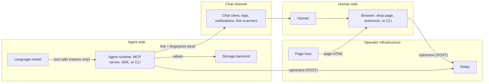

# Threat model

Status: current for the first release. The product is burndrop; this document names its parts generically: the relay, the drop page, the extension, the CLI, and the agent runtime (the MCP server or an SDK).

This document lists what the system protects, who it protects it from, how each attack is stopped or contained, what risk remains, and which test proves each claim. It is written to be checked line by line.

## 1. What the system does

A human and an AI agent exchange secrets (API keys, passwords, tokens, connection strings) through a relay that never sees plaintext.

- **Drop** (human to agent): the agent creates a fresh keypair, the human encrypts to the agent's public key in the browser, the relay stores ciphertext, the agent fetches and deletes it in one atomic step.
- **Reveal** (agent to human): the agent encrypts with a random key, the key travels in the URL fragment, the human clicks Reveal, the relay returns and deletes the ciphertext in one atomic step, the browser decrypts.

Every drop opens once. Every drop expires. Keys live only in URL fragments and on the agent, never on the relay.

## 2. Security goals

| Goal | Statement |
|---|---|
| Confidentiality | No party other than the intended human and the intended agent can learn a secret value. This includes the relay operator, the network, DNS, and link scanners. |
| Integrity | Any modification of ciphertext, keys, or displayed metadata is detected before a value is accepted or shown. |
| One-time delivery | A drop is readable exactly once. A second read fails with a distinct, visible state. |
| Detectability | If someone else opened a link first, the intended recipient sees that it was already opened, so the credential can be rotated. |
| Minimal metadata | The relay stores ciphertext, an identifier, token hashes, state, and expiry. Nothing else. Purpose text and secret names never reach the relay. |
| Model isolation | The language model driving the agent never has a secret value in its context, in tool output, or in logs. |
| Bounded lifetime | Every drop has a TTL (default 1 hour; the operator's maximum is 24 hours by default and can be raised to 7 days). Nothing about a drop is written to disk on the relay. |

## 3. System overview and trust boundaries

Trust boundaries, from most to least trusted:

| Party | Trust we place in it |
|---|---|
| Human | Trusted. Owns the secret. Decides what to drop and whether the displayed purpose is acceptable. |
| Agent runtime (MCP server, SDK, CLI process) | Trusted with secret values. Holds private keys and talks to the storage backend. Runs on the operator's machine. |
| Language model | **Not trusted with values.** Trusted only to call tools. Treated as a confused deputy that may be manipulated by anything it reads. It never receives a value. |
| Storage backend | Trusted to the extent the operator chose it. Documented per backend. |
| CLI and extension | Trusted code the human installed once and can verify. |
| Drop page (hosted) | Trusted only at the moment of use. The weakest of the three ways to open a drop. Verifiable by published hash. |
| Relay | **Not trusted with plaintext, keys, or metadata.** Trusted only for availability. |
| Chat channel | **Not trusted.** May be logged, scanned, previewed, forwarded, and read by admins or attackers. |
| Network and DNS | **Not trusted.** TLS is defense in depth, not the security boundary. |

The design principle that follows: the only thing that must be honest for confidentiality to hold is the code that runs at the two ends (the human's client and the agent runtime). Everything between them can be hostile.

## 4. Assets

| ID | Asset | Where it exists | Sensitivity |
|---|---|---|---|
| A1 | Secret value | Human's clipboard and browser memory; ciphertext on relay; agent memory; storage backend | Critical |
| A2 | Agent request private key (per drop) | Agent memory only, until the drop is fetched, then destroyed | Critical while the drop is pending |
| A3 | Reveal key (per reveal) | URL fragment, browser memory | Critical until opened, worthless after |
| A4 | Tokens: upload, fetch, reveal, revoke | Fragment (upload, reveal); agent memory (fetch, revoke); hashed on the relay | High |
| A5 | Agent API key (relay access) | Agent config; hashed on relay | High |
| A6 | Metadata: purpose, storage label, retention, secret name | Fragment and inside the encrypted envelope; agent side | Medium. Reveals what secrets exist and where they are kept. |
| A7 | Drop page code | Page host, extension bundle, CLI | High. A malicious page defeats the hosted tier. |
| A8 | Relay availability | Relay | Medium |

## 5. Attackers

| Attacker | Capabilities assumed |
|---|---|
| Network attacker | Reads and modifies traffic, hijacks DNS or BGP, obtains a valid certificate for the relay or page domain through hijacked domain validation. |
| Relay operator or intruder | Full read and write access to the relay process, its store (memory or Redis), its logs, and the host. Can serve any HTTP response, including a modified page if the page is served from the same host. |
| Page host intruder | Can replace the drop page served to users. |
| Chat channel observer | Reads every message, link, and notification. Includes workspace admins, compromised accounts, retention archives, link preview scanners, and security sandboxes that open links. May also modify messages in transit in the worst case. |
| Prompt injection attacker | Controls text the model reads (web pages, files, tool output, emails). Can cause the model to call tools with attacker-chosen arguments. |
| Unauthenticated internet user | Can send any request to the relay and page. |
| Local unprivileged process on the agent host | Same OS user as the agent runtime. Considered partially, since backends differ in how they resist this. |

Out of scope (see section 8): attackers with control of the human's device or the agent host at the OS level, malicious browser extensions installed by the human, malware, keyloggers, screen capture, and physical access.

## 6. Threats, mitigations, and residual risk

Each threat lists the attack path, the impact if it succeeded, the design mitigations, what risk remains, and the test that proves the mitigation. Items marked "(added)" were additions to the original brief; all of them are implemented. The one item marked "(roadmap)" is not.

### T1. Compromised relay

**Attack.** The relay operator is malicious, the server is breached, or the Redis instance is exposed. The attacker reads the store, reads logs, modifies responses, or deletes data.

**What the attacker sees.** Ciphertext, drop IDs, SHA-256 hashes of tokens, a commitment (hash) to the recipient public key, state, timestamps, ciphertext sizes rounded to the padding block, client IP addresses, and the agent API key identifier.

**Impact if unmitigated.** Total loss of confidentiality.

**Mitigations.**
- End-to-end encryption. Drop ciphertext is a libsodium sealed box to the agent's per-request public key. Reveal ciphertext is XChaCha20-Poly1305 under a random key that exists only in the fragment. Neither key is ever sent to the relay.
- The page reads the recipient public key from the fragment only and never asks the relay for a key, so the relay cannot substitute one.
- Tokens are stored as SHA-256 hashes. A store dump does not yield usable tokens.
- Metadata (purpose, storage, retention, names) is never sent to the relay. It lives in the fragment and inside the encrypted envelope.
- No disk persistence. The default store is process memory. The Redis option is documented with persistence disabled, and there is no backup path.
- Modified ciphertext fails authentication at the client (Poly1305 tag), so the relay cannot feed a chosen value to either side.
- Logs contain route names, status codes, and latency. Never bodies, identifiers, or tokens.

**Residual risk.** The relay learns timing (when a drop was created, uploaded, fetched), approximate size, and the IP addresses of both ends. It can deny service and delete drops. If the relay also serves the drop page, a compromised relay becomes a compromised page host (T4).

**Tests.** Dump the store after a full exchange in both directions and assert that no plaintext, no token, and no metadata string appears. Tamper one byte of stored ciphertext and assert both clients reject it. Grep every log line for drop IDs, tokens, fragments, and secret values.

### T2. DNS hijack and man-in-the-middle

**Attack.** The attacker redirects the relay or page hostname to a server they control. Because ACME domain validation follows DNS, they can obtain a valid certificate, so TLS alone does not stop this. They now act as the relay and, if the page is on the same host, as the page host.

**Impact if unmitigated.** Same as T1 plus T4.

**Mitigations.**
- The design assumes the relay is hostile (T1), so an impostor relay gains nothing beyond ciphertext.
- The drop page is served with HSTS. Operators are told how to add CAA records, DNSSEC, and certificate transparency monitoring.
- The CLI and extension do not depend on the page host at all. They contain the crypto and the UI. A hijack of the page domain cannot change their code.
- Published SHA-256 hashes of each drop page release let a careful user verify the page they received. The page shows its version so it can be compared.
- This is the reason every deployment option in the docs, including nip.io and sslip.io where DNS belongs to a third party, still keeps secrets safe: confidentiality never depends on DNS or TLS.

**Residual risk.** A user of the hosted page during an active hijack of the page host is exposed (T4). Users on the CLI or extension are not.

**Tests.** Integration test that points clients at a fake relay that returns modified ciphertext, wrong status, or a substituted page, and asserts that clients reject values and that the extension and CLI ignore the served page.

### T3. Public key substitution

**Attack.** An attacker replaces the agent's public key so the human encrypts to the attacker's key. Three places this could happen: in the chat channel (editing the link before the human sees it), in the page (a malicious page ignores the fragment key), or at the relay (impossible by design, since the relay never sees the key and the page never asks it for one).

**Impact if unmitigated.** The attacker can decrypt the drop, but only if they also obtain the ciphertext. The ciphertext is released only to the holder of the fetch token, which only the agent has. So key substitution alone is not enough. The attacker also needs the relay (T1) or the fetch token.

**Mitigations.**
- Fresh keypair per request. There is no long-term key to steal or to substitute once.
- The fingerprint (SHA-256 of the public key, first 64 bits, shown as four groups of four hex characters) is shown by the agent in chat and by the page. A mismatch means the link was altered.
- (added) **Key commitment at the relay.** When the agent creates a slot it sends SHA-256 of the recipient public key. The upload must carry the same commitment computed by the page from the fragment key. A mismatch is rejected. An attacker who edits the link must now also control the relay. This makes key substitution require two independent compromises (chat channel and relay) instead of one.
- The displayed metadata (purpose, storage, retention) is encrypted inside the envelope by the browser. The agent compares it to what it generated and refuses the drop on mismatch, then tells the human. A tampered link is caught even if the human did not compare fingerprints.
- The extension and CLI compute the fingerprint locally from the link, so a malicious page cannot fake it there.

**Residual risk.** An attacker who controls both the chat channel and the relay, or both the chat channel and the page host, wins against hosted-page users. Fingerprint comparison is a manual step most humans will skip, so it is a backup, not the primary control. The primary control is the two-compromise requirement above.

**Tests.** Swap the key in a link and assert: the page shows a different fingerprint, the relay rejects the upload (commitment mismatch), and if the relay is replaced by a permissive fake, the agent cannot decrypt and reports failure without leaking. Alter the purpose text in a link and assert the agent rejects the drop for metadata mismatch.

### T4. Malicious drop page served to the human

**Attack.** The page host, the relay (if it serves the page), a CDN, or a certificate-holding network attacker serves a page that exfiltrates what the human pastes (drop) or the decrypted value (reveal, since the key is in the fragment and the page can read it). A lookalike domain is a variant.

**Impact if unmitigated.** Loss of confidentiality for users of the hosted page.

**Mitigations.**
- Three ways to open a drop, ranked by trust. The CLI does all crypto locally and never loads the page. The extension replaces the hosted page with its own bundled, store-signed copy whenever it sees a drop link on a configured relay host. The hosted page is the convenience tier.
- The page is a single self-contained HTML file with no external resources. One SHA-256 hash covers everything. The hash of every release is published in the repository and in the GitHub release. The page displays its version.
- Strict Content-Security-Policy with hash-pinned scripts and styles, no inline event handlers, `connect-src` limited to the relay origin, `frame-ancestors 'none'`, `form-action 'none'`, `base-uri 'none'`. This stops injected third-party script and framing. It does not stop a fully replaced first-party page, which is why the hash and the extension exist.
- Subresource Integrity is not needed because there are no subresources. If a future build splits files, SRI is mandatory.
- The page can be served from an origin separate from the relay so that a relay compromise does not automatically become a page compromise. This is an option, not the default, because on a single host it adds a hostname without adding security (see the design doc).
- (added) `verify-page` command in the CLI and a "verified page" indicator in the extension: fetch the page, hash it, compare to the published manifest for the version it declares. This is the Code Verify pattern.

**Residual risk.** Hosted-page users trust the page host at the moment of use. This is stated plainly in the docs. The extension and CLI remove this trust.

**Tests.** Browser test that serves a modified page and asserts the extension redirects to its bundled copy. Hash of the built page matches the hash in the release manifest (release workflow check). CSP header test with a script injection attempt.

### T5. Link preview scanners and security sandboxes burning drops

**Attack.** Slack, Teams, Gmail, Outlook, and enterprise security tools fetch links to render previews or to detonate them in a sandbox. If fetching the link consumed the drop, the human would find it already opened.

**Mitigations.**
- No GET or HEAD request changes any state. The page URL returns a static page. API endpoints reject GET and HEAD with 405.
- The URL fragment is never sent to a server, so a scanner that fetches the URL sees only the path (`/drop` or `/reveal`). Drop IDs and tokens are in the fragment, so a scanner learns nothing, not even which drop exists.
- Consuming a drop requires a POST with a JSON body and a custom request header from a click on the page. Sandboxes that only fetch do nothing. Sandboxes that execute JavaScript but do not click do nothing.
- The reveal action is a single deliberate click with a warning that it can only be done once. (roadmap) A two-step confirmation could be enabled for environments known to run sandboxes that click buttons.
- Because every drop is one-time, a burn by a sandbox is visible: the human sees "already opened" with a timestamp and the agent can re-send after rotating.

**Residual risk.** A sandbox that executes JavaScript and clicks buttons can burn a reveal link. The human will see it and the agent will re-send. The value would be inside the sandbox operator's system, which the organization chose to trust with its links.

**Tests.** Simulate scanners: GET and HEAD on every route, with and without common scanner user agents, and assert 200 or 405 with no state change. Headless browser loads the reveal page without clicking and asserts the drop is still available.

### T6. Replay attacks

**Attack.** An attacker who captured a request (upload, fetch, reveal, revoke) replays it.

**Mitigations.**
- TLS prevents capture on the network in practice. The design does not rely on it.
- Upload tokens are consumed by the first successful upload. A replay gets 409 with state "already uploaded".
- Fetch and reveal are atomic read-and-delete. A replay gets a distinct "already opened" or "not found" state.
- A replayed ciphertext uploaded to a different slot is useless: it is bound to a different recipient key (drop) or a different key and additional data (reveal).
- Retries are safe: the page treats 409 "already uploaded" as success for the same slot, so a timed-out upload does not produce a false failure.

**Residual risk.** None beyond T1 for confidentiality.

**Tests.** Replay each request type after success and assert the documented status. Two concurrent fetches of the same drop: exactly one succeeds.

### T7. Unauthorized deletion, revocation, or slot poisoning

**Attack.** An attacker deletes or revokes drops to disrupt, or fills a slot with garbage so the real upload is refused.

**Mitigations.**
- Revoke requires a valid token for that slot. The drop ID alone does nothing.
- Upload requires the upload token. Knowing the drop ID does not allow poisoning.
- There is deliberately no lockout after failed token attempts, because a lockout would let anyone who learned a drop ID disable that slot. Tokens have 128 bits of entropy, so brute force is infeasible; rate limits per IP bound the attempt rate anyway.
- (added) Slot creation requires an agent API key, so strangers cannot create or fill slots at all.
- The expiry sweeper deletes only expired entries and is the only automatic deletion path.

**Residual risk.** A relay intruder can delete anything (availability only). A revoked or deleted drop is visible as such to both sides.

**Tests.** Revoke with a wrong token, with the drop ID only, and with the other side's token (allowed). Upload twice. Assert states.

### T8. Leaks through logs, backups, clipboard, browser history, and model context

Each channel, its mitigation, and the residual risk:

| Channel | Mitigation | Residual risk |
|---|---|---|
| Relay access logs | Identifiers live in the fragment and request bodies, never in URLs. Access logs record method, route name, status, and latency. Bodies are never logged. The proxy (Caddy) logs the path, which is only `/drop`, `/reveal`, or `/api/...` with no identifiers. | None by construction. |
| Relay error logs | Errors are logged with a request ID and a category. Never with request bodies or headers. | Operator mistakes in custom logging. Documented. |
| Relay backups | No disk persistence. Memory store by default. Redis documented with `save ""` and `appendonly no`, and the docs say not to back it up. | An operator who enables Redis persistence against the docs would have ciphertext and token hashes on disk, still no plaintext. |
| Agent runtime logs | Values are never logged. Error text that reaches the audit log passes through the redaction filter, which knows every value the process has fetched, stored, or injected. | Subprocess output that transforms a value (base64, split) can evade redaction. Documented. |
| Model context | `fetch_secret` returns a reference name and metadata. `run_with_secret` injects values as environment variables into a subprocess and redacts known values from captured output. `send_secret` takes a name. `list_secrets` returns names and metadata. Errors are sanitized. | Redaction is best effort. A subprocess that prints a transformed value can leak it into output. Documented, with `run_with_secret` output limits and a per-call option to discard output. |
| Clipboard | Copy happens only on an explicit click. The page offers a clear-clipboard action next to the value. It does not overwrite the clipboard on a timer, because a blind overwrite would destroy whatever the human copied afterwards. | Clipboard managers and OS clipboard history (Windows clipboard history and cloud clipboard, macOS utilities) may retain the value. The docs say so and recommend disabling cloud clipboard sync on machines used for secrets. |
| Browser history and URL bar | The page removes the fragment from the address bar with `history.replaceState` as soon as it has read it, before any network call. `Referrer-Policy: no-referrer`. `Cache-Control: no-store`. No service worker, no local storage of secrets. After a drop is consumed, the link in history is worthless: the upload token is spent and the public key is public, or the reveal ciphertext is gone. | A live reveal link sits in history until it is opened or expires. Browser tab sync may copy the URL to another device within that window. Short TTLs limit this, and with the reveal password turned on a copied link decrypts nothing on its own. |
| Chat history and notifications | The link is only dangerous until consumed. The agent is instructed never to repeat a link and to keep TTLs short. | Retention archives hold spent links, which is harmless, and live links for the TTL window. |
| Screenshots, screen sharing, shoulder surfing | The value is masked by default; showing it is an explicit action. The fragment leaves the address bar immediately. | Out of scope beyond these defaults. |
| Agent memory, swap, crash dumps | Private keys and values are zeroed after use where the language allows (Go, libsodium `memzero`). | Garbage-collected runtimes and the OS can keep copies. Documented as best effort. |

**Tests.** After a full test run, grep all relay logs, proxy logs, agent logs, and MCP tool outputs for every drop ID, token, fragment, and secret value used in the run. Assert zero matches. Assert that the fragment is gone from `location.href` before the first request in browser tests.

### T9. Compromised endpoint (out of scope)

If the human's device or the agent's host is controlled by an attacker at the OS level, no protocol can help. The device that displays a secret can capture it. The host that holds a private key can read it. Malware, keyloggers, malicious browser extensions installed by the user, and screen capture all belong here. This is the boundary of every end-to-end encrypted system, and pretending otherwise would be dishonest.

What the design still does at the endpoints, because it reduces exposure without claiming to prevent it: short lifetimes, one-time reads, immediate destruction of request keys, masked display by default, and the model-isolation rules that keep values out of the largest and least controllable memory on the agent side (the model's context).

### T10. Prompt injection and the confused-deputy agent

This threat is specific to agents and is the most important one on the agent side.

**Attack.** Text the model reads (a web page, a file, an email, another tool's output) instructs it to misuse the tools. Four concrete paths:
1. `send_secret("prod-db-password")` followed by posting the link somewhere the attacker reads (the chat itself if the attacker is present, or through another tool that can make requests).
2. `request_secret` with a deceptive purpose to phish the human for a secret the task does not need.
3. `run_with_secret` with a command that exfiltrates the injected environment variable.
4. `delete_secret` or `revoke_request` to disrupt.

**Mitigations.**
- The model never holds a value, so path 1 can only exfiltrate a one-time link, not a value, and the theft is visible to the human as "already opened" if they try the link.
- MCP clients show each tool call and its arguments for approval. `send_secret`, `run_with_secret`, and `delete_secret` are marked as destructive or sensitive in their tool annotations so clients that honor annotations require confirmation.
- (added) When the client supports MCP elicitation, `send_secret` asks the human to confirm the secret name and destination before creating a reveal link. Without elicitation, the client's approval prompt is the gate.
- Secrets carry a `sendable` flag set at request time. A secret requested as "use in this environment only" cannot be sent with `send_secret` at all.
- The drop page shows the purpose, storage location, and retention in plain language so the human can refuse a request that does not match the task (path 2). The agent instruction file requires the agent to state the same in chat.
- `run_with_secret` supports an operator allowlist of commands and injects only the named secrets, each under a declared environment variable name. Output is size-limited and redacted.
- Every tool action is written to a local audit log with names, never values.

**Residual risk.** A client configured to auto-approve tool calls removes the human gate. Any process that receives a secret can leak it. The documentation says both plainly and recommends network egress controls for high-value environments.

**Tests.** MCP tests that call each tool with attacker-style arguments and assert that no value appears in any tool result, that `send_secret` refuses non-sendable secrets, and that the audit log contains no values.

### T11. Token guessing and enumeration

**Attack.** Guess a token or a drop ID.

**Mitigations.** Every token and ID is 128 bits from the operating system CSPRNG. Tokens are compared by hashing the presented value and comparing the hash in constant time. There is no endpoint that lists drops. Rate limits per IP bound request rates.

**Residual risk.** None practical.

**Tests.** Statistical sanity test on token generation (length, encoding, uniqueness across 100k samples). Rate limiter tests.

### T12. Metadata leakage through the relay

**Attack.** The relay infers what is being exchanged from sizes, timing, and addresses.

**Mitigations.** Plaintext is padded to a multiple of 256 bytes before encryption, so the relay sees only coarse size classes. Purpose text and secret names never reach the relay. The agent API key identifies an agent to its own operator only.

**Residual risk.** Timing correlation between the agent's requests and the human's requests, and both IP addresses, are visible to the relay. A relay is a rendezvous point and cannot hide this. Users who need address privacy can use a VPN or Tor for the browser side.

**Tests.** Ciphertext length is a multiple of the block plus fixed overhead for a range of plaintext sizes.

### T13. Open relay abuse and phishing with the operator's domain

**Attack.** Anyone on the internet creates reveal links on the operator's domain and sends them to victims. The domain's reputation makes the phishing credible. Storage and bandwidth are consumed.

**Mitigations.**
- (added) Slot creation requires an agent API key issued by the operator. This is on by default and can be disabled for private networks. Per-agent rate limits key on it.
- The reveal page renders the decrypted value as inert text. Nothing inside it is turned into a link or HTML. The page carries a fixed notice that content comes from an automated agent.
- Size limits, TTL limits, a global cap on live slots, and per-IP rate limits bound resource abuse.

**Residual risk.** A stolen agent API key allows abuse until rotated. Keys are hashed on the relay and can be revoked individually.

**Tests.** Slot creation without a key is rejected when keys are enabled. A reveal payload containing HTML and URLs is displayed as text with no anchor elements.

### T14. Supply chain and build integrity

**Attack.** A malicious dependency, a tampered build, or a tampered release replaces the crypto or adds exfiltration.

**Mitigations.** Minimal dependencies, each documented with a reason. Exact version pins and lockfiles. Dependabot and dependency review on every pull request. CodeQL. GitHub Actions pinned by commit SHA with least-privilege tokens. Reproducible Go builds with `-trimpath`. Release workflow produces checksums, an SBOM, Sigstore signatures, and provenance attestations for binaries, container images, npm packages, and Python packages. The drop page hash is published per release. The libsodium package is pinned to an exact version with its lockfile integrity hash, and the published page hash covers the embedded WebAssembly artifact.

**Residual risk.** A compromise of an upstream library at the source (libsodium, Go's x/crypto) would affect every user of those libraries. Pinning and hash verification limit exposure to a deliberate upgrade.

**Tests.** Release workflow verifies its own artifacts (signature, attestation, page hash) before publishing. CI fails on unpinned actions.

### T15. Storage backend exposure on the agent side

**Attack.** A process running as the same OS user, or a backup, reads stored secrets.

**Mitigations.** Backends are ranked and the runtime recommends the strongest available one on first run. The docs state each backend's exposure honestly: OS keychains are readable by processes in the same user session (macOS prompts per application); external managers add their own access control and audit; the age vault is encrypted at rest with its key in the keychain or a passphrase; memory-only vanishes at exit; the `.env` backend is plaintext on disk, opt-in, marked weakest, enforced at mode 0600, and refused if the file is not ignored by git.

**Residual risk.** Inherent to the chosen backend. The runtime cannot protect a secret from the OS user that owns it.

**Tests.** Each backend: put, get, list (names only), delete, expiry, permission failure, missing dependency, and the gitignore check for `.env`.

### T16. Expiry and clock handling

**Mitigations.** The relay clock is authoritative. TTL is enforced server-side at every read. The countdown on the page is informational. Expired entries are removed by a sweeper and also treated as absent if read before the sweep. Requests above the operator's maximum TTL (24 hours by default, at most 7 days) are clamped, never refused.

**Tests.** Read at and after expiry returns the "expired" state. TTL above the maximum is clamped.

### T17. Link format confusion and downgrade

**Mitigations.** The fragment carries a version field that must be present and recognized. Unknown versions are refused, never guessed. Parsing is strict: required fields, fixed lengths for keys and tokens, bounded lengths for text. The parser is fuzzed.

**Tests.** Fuzz tests on the fragment parser (`internal/link/fuzz_test.go`), on the envelope decoder and the padding (`internal/crypto/fuzz_test.go`), and on the relay's request decoder across every endpoint (`internal/relay/fuzz_test.go`).

### T18. Denial of service against the relay

**Mitigations.** Caps on live slots (count and total bytes), request body limits, per-IP and per-key rate limits, read and write timeouts, a cap on concurrent long-poll waits, and cheap rejection of unauthenticated slot creation. Horizontal scale with the Redis store behind a load balancer.

**Residual risk.** Volumetric attacks need upstream protection (CDN, cloud rate limiting). Documented.

### T19. Web attacks against the page

**Mitigations.** The page has no cookies, no sessions, and no server-rendered content. CSP as in T4. `X-Content-Type-Options: nosniff`, `Cross-Origin-Opener-Policy: same-origin`, `Cross-Origin-Resource-Policy: same-origin`. The API accepts only `Content-Type: application/json` plus a custom header, which forces a CORS preflight for cross-origin callers, and the CORS allowlist contains only configured page origins plus browser extension origins (`chrome-extension://` and `moz-extension://`), which only an installed extension's bundled page can present. Values are placed into the DOM with `textContent`, never `innerHTML`. Clickjacking is blocked by `frame-ancestors 'none'`.

**Tests.** Header assertions on every response. XSS payloads as secret values render as text.

### T20. Human error

**Scenarios and mitigations.** Link sent to the wrong person: one-time delivery makes the mistake visible, the agent can revoke (`revoke_request`, `burndrop revoke`) and the relay accepts either token, TTL is short. Wrong secret pasted: revoke before the agent fetches; the agent confirms only the reference name, never the value. Secret pasted into chat: the agent instruction file requires the agent to say it is exposed, recommend rotation, and offer a drop link.

## 7. Ways to open a drop, ranked by trust

| Tier | What runs the crypto | Defeats | Does not defeat |
|---|---|---|---|
| 1. CLI | Local signed binary | Hostile relay, hostile page host, DNS hijack, network attacker, chat channel tampering when combined with the relay commitment | Compromised local machine |
| 2. Extension | Store-signed extension bundle | Same as CLI for pages on configured relay hosts | Compromised local machine, drop links on hosts the user did not add |
| 3. Hosted page | Page served by the operator | Hostile relay when the page is hosted separately, network attackers without a certificate, link scanners | A compromised or impersonated page host |
| 3b. Local copy of the page | The single-file page saved locally after hash verification | Same as tier 2 | Compromised local machine |

## 8. Out of scope

- Compromised endpoints (T9), including malicious browser extensions, malware, and OS-level attackers.
- Traffic analysis that reveals that an exchange happened between two IP addresses at a given time.
- Availability guarantees beyond the documented limits and horizontal scaling.
- Protection of a secret after it has been legitimately delivered to a subprocess by `run_with_secret`.
- Insider threats at the human's or operator's organization beyond what the controls above provide.

## 9. Security properties claimed

1. The relay, the network, DNS, and any link scanner cannot learn a secret value, a key, a purpose, or a secret name.
2. A drop can be read exactly once by the holder of the correct token.
3. A second reader sees a distinct "already opened" state, so theft is detectable.
4. Substituting the recipient public key requires compromising both the chat channel and the relay, or the chat channel and the page host.
5. Modified ciphertext or modified displayed metadata is detected before a value is accepted.
6. No identifier, token, key, or value ever appears in a URL path, a query string, a log line, or a tool result returned to the model.
7. Nothing about a drop is written to disk on the relay in the default configuration.
8. With the reveal password turned on, the holder of a reveal link cannot decrypt the value without the password. The attempt burns the relay copy, which the human notices, and guessing offline runs against Argon2id at 64 MiB per attempt.

Properties not claimed: protection from a compromised endpoint, hiding that an exchange took place, and protection of the hosted page from its own host.

## 10. Threat-to-test map

| Threat | Where it is tested |
|---|---|
| T1 | `internal/relay/adversarial_test.go`: TestStoreDumpIsUnreadable, TestLogsContainNoSecrets, TestTamperedCiphertextIsRejectedByClients |
| T2 | `internal/relay/adversarial_test.go`: TestTamperedCiphertextIsRejectedByClients; `internal/agent/agent_test.go`: TestFetchOutcomes, TestRelayFailures; `extension/e2e/extension.spec.ts`: the page a protected relay serves never runs |
| T3 | `internal/relay/adversarial_test.go`: TestKeySubstitutionThroughLinks; `internal/relay/handlers_test.go`: TestUploadTwiceAndCommitment; `internal/agent/agent_test.go`: TestFetchOutcomes (metadata mismatch); `web/e2e/page.spec.ts`: rejects a link whose key was swapped, a link with a changed name cannot decrypt the secret |
| T4 | release workflow page hash verification; `internal/relay/handlers_test.go`: TestSecurityHeadersAndPage; `web/e2e/page.spec.ts`: CSP header; `extension/e2e/extension.spec.ts`: verify mode |
| T5 | `internal/relay/adversarial_test.go`: TestScannersCannotBurnDrops; `web/e2e/page.spec.ts`: reveals once, and only after a click |
| T6 | `internal/relay/adversarial_test.go`: TestReplay, TestConcurrentSingleRead |
| T7 | `internal/relay/handlers_test.go`: TestRevokeByEitherSide, TestUploadTwiceAndCommitment, TestBadTokens; `internal/relay/adversarial_test.go`: TestFetchWithoutFetchToken |
| T8 | `internal/relay/adversarial_test.go`: TestLogsContainNoSecrets; `web/e2e/page.spec.ts`: the fragment is gone before the first request; `internal/mcpserver/server_test.go`: TestFullFlow asserts that no value appears in any tool output |
| T8, property 8 (reveal password) | `internal/crypto/vectors_test.go`: the `reveal_password` vectors in all three languages; `internal/agent/agent_test.go`: TestSendWithPassword; `cmd/burndrop/reveal_password_test.go`; `internal/mcpserver/server_test.go`: TestRevealPasswordTool asserts that neither the password nor the value reaches a tool result; `web/e2e/page.spec.ts`: asks for the reveal password and forgives a wrong one; `spec/interop`: the reveal with password case |
| T10 | `internal/mcpserver/server_test.go`: TestFullFlow, TestSendWithoutElicitation; `internal/agent/agent_test.go`: TestSend (sendable flag, audit log) |
| T11 | `internal/crypto/crypto_test.go`: TestTokens; `internal/relay/handlers_test.go`: TestRateLimits, TestAnonymousAgentsAreMeteredPerAddress |
| T12 | `internal/crypto/crypto_test.go`: TestPadding; the `padding` section of `spec/vectors.json` in all three languages |
| T13 | `internal/relay/handlers_test.go`: TestAgentAuth; `web/src/state.ts` carries the notice about automated senders shown on every reveal |
| T14 | release workflow self-verification; `.github/workflows/hygiene.yml` (pinned actions); `.github/workflows/dependency-review.yml` |
| T15 | `internal/storage/*_test.go` including failure modes, driven by the conformance suite in `suite_test.go` |
| T16 | `internal/relay/handlers_test.go`: TestExpiry, TestTTLClamp; `web/e2e/page.spec.ts`: shows expired and revoked links |
| T17 | `internal/link/fuzz_test.go`, `internal/crypto/fuzz_test.go`, `internal/relay/fuzz_test.go` |
| T18 | `internal/relay/handlers_test.go`: TestStoreFull, TestRateLimits, TestLongPoll, TestRequestValidation |
| T19 | `internal/relay/handlers_test.go`: TestSecurityHeadersAndPage, TestCORS; `web/e2e/page.spec.ts`: values are shown through text nodes and the page states render as expected |
